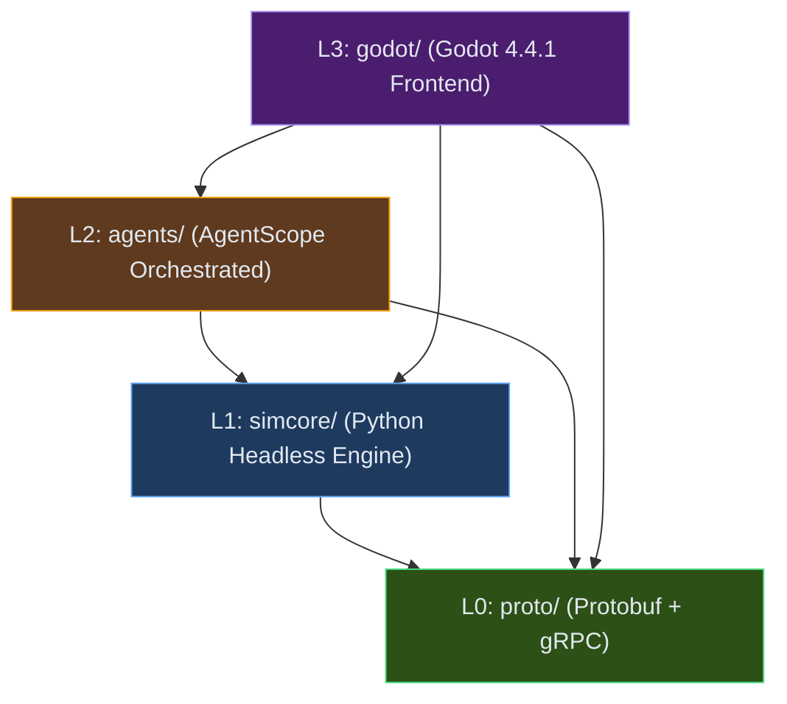

# Architecture

## System Overview

RTS-AI-Platform is a four-layer decoupled architecture for AI-native RTS game development:

```
┌─────────────────────────────────────────────────────────────┐
│                    Pipeline (工具链)                          │
│  地图/单位/技能/关卡/美术/构建/部署/数据回流                    │
├─────────────────────────────────────────────────────────────┤
│                    Harness (训练验证)                         │
│  BuildRunner | MatchScheduler | SimulationPool              │
│  ReplayParser | MetricsAggregator | ExperimentRegistry      │
│  PromotionGate                                              │
├─────────────────────────────────────────────────────────────┤
│                   AgentHub (Agent运行)                        │
│  M0: BaselineAgent (单体脚本)                                │
│  M1: Coordinator → Economy + Combat                         │
│  M2: Coordinator → Strategy + Economy + Combat + Scout + Build│
├─────────────────────────────────────────────────────────────┤
│                    SimCore (仿真内核)                          │
│  规则引擎 | 状态管理 | 命令处理 | 回放系统 | 协议层              │
└─────────────────────────────────────────────────────────────┘
```

## Layer Dependencies



**Enforcement**: `scripts/lint_deps.py` blocks forbidden imports at CI time.

## Core Components

### SimCore (L1) — Python Headless Engine

The deterministic simulation kernel. No rendering, no I/O delays. Pure game logic.

| Module | Responsibility |
|--------|---------------|
| `engine.py` | Game loop, tick system, agent integration |
| `state.py` | Immutable state snapshots (frozen dataclass) |
| `rules.py` | Rule engine: movement, combat, fog-of-war, economy |
| `entities.py` | Entity types: Unit, Building, Resource |
| `mapgen.py` | Procedural map generation from seed |
| `replay.py` | Deterministic replay recorder + player |
| `grpc_server.py` | gRPC server exposing SimCore to Godot |

**Determinism contract**: Same seed + same command sequence → identical replay.
This is verified by the test suite (`tests/simcore/test_replay.py`).

### AgentHub (L2) — AgentScope Runtime

Multi-agent orchestration for game decisions. Uses AgentScope framework.

| Module | M0 | M1 | M2 |
|--------|----|----|-----|
| `script_ai.py` | ✓ (BaselineAgent) | ✓ (fallback) | ✓ (fallback) |
| `base_agent.py` | ✓ (ReActAgent wrapper) | ✓ | ✓ |
| `coordinator.py` | — | ✓ | ✓ |
| `economy.py` | — | ✓ | ✓ |
| `combat.py` | — | ✓ | ✓ |
| `strategy.py` | — | — | ✓ |
| `scout.py` | — | — | ✓ |
| `build.py` | — | — | ✓ |

**AgentScope mapping**:
- `MsgHub` → Blackboard pattern (coordinator broadcasts, agents subscribe)
- `SequentialPipeline` → Ordered agent execution per tick
- `FanoutPipeline` → Parallel agent execution per tick
- `ReActAgent` → Observe→Think→Command loop per agent

### Protocol Layer (L0) — Protobuf + gRPC

Cross-layer communication is exclusively through protobuf messages.

| Proto | Purpose |
|-------|---------|
| `obs.proto` | World observation, local observation, fog-of-war state |
| `cmd.proto` | Move, attack, build, gather, research commands |
| `state.proto` | Full state snapshot for replay and telemetry |

### Frontend (L3) — Godot 4.4.1

Thin rendering shell. Game logic lives in SimCore, not in Godot.

| Component | Responsibility |
|-----------|---------------|
| `scenes/` | Godot scene files (.tscn) |
| `scripts/` | Scene controllers (thin: wire signals, update UI) |
| `grpc_bridge.gd` | gRPC client to SimCore server |
| `addons/` | Godot addons |

**Invariant**: Scene scripts must not contain game logic. They only:
1. Receive state from gRPC bridge
2. Update visual representation
3. Forward player input to SimCore

## Architecture Decision Records

| ADR | Title | Summary |
|-----|-------|---------|
| ADR-1 | Gradual Agent Splitting | M0 mono → M1 3-core → M2 full-6 |
| ADR-2 | Protobuf + gRPC | Sole cross-layer protocol |
| ADR-3 | LLM Out of High-Freq Loop | Compile trajectories to scripts |
| ADR-4 | Python Headless SimCore | Not Unity headless server |
| ADR-5 | AgentScope Framework | MsgHub + ReAct + Trinity-RFT |

Full ADRs: `docs/architecture/four-layers.md`

## Data Flow

```
Tick N:
  1. SimCore generates GameState snapshot (immutable)
  2. GameState → obs.proto → AgentHub (via gRPC)
  3. AgentHub: Coordinator broadcasts via MsgHub
  4. Each agent: observe → think → produce cmd.proto
  5. Commands collected → SimCore.rules.apply(state, commands, tick+1)
  6. New GameState snapshot → replay.append()
  7. State → gRPC → Godot (render if connected)
```

## Parallel Simulation (Harness)

For RL training, SimCore runs headless in parallel:

```
SimulationPool (32-64 instances)
  └── Each: SimCore + BaselineAgent
      ├── Same seed → same game
      ├── Different seeds → diverse training data
      └── No GPU needed (pure Python + NumPy)
```

Throughput target: 32-64 concurrent 2D battles on a single machine.