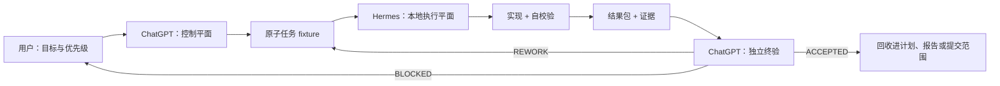

# ChatGPT 与 Hermes 研发编排操作手册

**适用对象：** 使用 ChatGPT 进行项目中控、使用本地 Hermes 执行实现任务的研发人员与 Agent。
**权威决策：** `docs/architecture/adr-chatgpt-hermes-orchestration.md`

## 1. 工作方式



核心规则只有三条：

1. ChatGPT 拆分、路由和终验，不把 Hermes 的自判当作最终结论。
2. Hermes 一次只执行一个任务单元，并对该单元完成实现和自校验。
3. 每次执行都必须返回结果包；失败和阻塞也是有效结果，沉默退出不是。

## 2. ChatGPT：接收与拆分

### 2.1 先冻结上下文

分派前记录：

- 当前分支与 `git rev-parse HEAD`；
- `git status --short` 中与任务无关的已有变更；
- 权威需求或计划路径；
- 相关架构层、owner 和验证入口；
- 需要用户批准的网络、许可、破坏性或不可逆动作。

### 2.2 切成原子任务

优先按可演示的垂直切片拆分，而不是按文件类型拆分。一个单元应能在一次 Hermes 运行中得到明确的 `PASS`、`FAIL` 或 `BLOCKED`。

需要拆开的信号：

- 同时包含协议变更和 Godot 表现变更；
- 同时包含根因调查和大范围实现；
- 验证命令属于不同运行环境；
- 两部分可以独立回滚；
- 修改路径与另一个任务重叠；
- 单元没有一个清晰的完成状态。

不应拆开的信号：

- 测试和对应实现被拆成两个任务；
- 只交付代码，不交付验证；
- 只修改 manifest，却不验证实际加载路径；
- 只生成报告，却没有连接到权威规格和证据。

### 2.3 建立依赖图

每个任务记录 `blocked_by`。协议、状态模型和共享场景修改默认串行；写路径完全独立、输入已冻结的任务才可并发。

任务状态使用：

```text
blocked -> ready -> in_progress -> verification -> done
```

其中 fixture 的 `done` 仍需经过 ChatGPT 终验，才映射为控制面的 `ACCEPTED`。

## 3. ChatGPT：生成任务包

机器可读任务优先写为 `harness/skills/tasks/<domain>/<task-id>.json`，并通过：

```bash
python3 harness/skills/validate_tasks.py
```

Schema 为 `harness/skills/tasks/schema.json`。交给 Hermes 的人类可读投影使用：

```text
docs/agents/templates/hermes-task-unit-template.md
```

任务包必须明确：

- 唯一 `task_id` 和单一目标；
- `source_spec` 与 `fixed_point`；
- `allowed_paths` 与 `forbidden_paths`；
- 第一条检查命令；
- 验收条件和完整验证命令；
- 预期证据；
- 停止条件和结果包格式。

任务包不得包含大段聊天记录，也不得要求 Hermes 自行“看看还能做什么”。

## 4. Hermes：执行单元

本机 Hermes 的已验证入口是 `$HOME/code/hermes-agent/venv/bin/hermes`。为避免把个人绝对路径写死在任务中，统一通过 `HERMES_BIN` 调用：

```bash
export HERMES_BIN="${HERMES_BIN:-$HOME/code/hermes-agent/venv/bin/hermes}"
test -x "$HERMES_BIN"
```

单任务默认使用带 checkpoint 的 `chat --query`。在 RTS 仓库根目录执行：

```bash
"$HERMES_BIN" chat \
  --query "Read and execute the single task unit at <absolute-task-file>. Return the required Hermes Result Envelope." \
  --checkpoints \
  --pass-session-id \
  --source tool
```

不要把 `--oneshot/-z` 或 `--yolo` 作为默认路由入口：当前 Hermes 的 oneshot 模式会自动绕过危险命令审批。并行任务只有在写路径不重叠时才加 `--worktree`，而且结果包必须记录 worktree 路径、分支和提交；控制面终验后再决定如何回收。

`batch_runner.py` 适合评测或生成 fresh-agent traces，不是修改同一工作区中共享业务代码的默认执行器。无论入口是 CLI、桌面端还是 batch runner，下面的执行契约保持一致。

Hermes 的执行顺序：

1. 读取任务包、`AGENTS.md`、`source_spec` 和被点名的 skill；
2. 校验当前 HEAD 是否等于 `fixed_point`，记录已有无关变更；
3. 运行任务包的第一条命令，先复现或建立基线；
4. 在 `allowed_paths` 内完成最小实现；
5. 运行所有 `verification_seams`；
6. 检查禁止路径、工作区污染和 diff 范围；
7. 生成 `hermes-result-<task-id>.md`；
8. 若任务属于 SkillEvolver 流程，同时写入真实 `SkillTrial` 证据。

Hermes 必须停止并返回 `BLOCKED` 的情况：

- HEAD 与固定点不一致，且无法证明变更属于当前任务；
- 必须修改禁止路径才能继续；
- 权威规格互相矛盾；
- 缺少资产、凭据、服务或用户许可；
- 验证环境不可用，且没有等价的可信验证方法；
- 发现相邻任务正在修改相同的共享文件。

## 5. Hermes：自校验

自校验至少包含四层：

| 层级 | 要回答的问题 | 常用证据 |
|---|---|---|
| 功能 | 目标行为真的发生了吗 | 针对性测试、运行截图、replay、fixture 输出 |
| 回归 | 邻近行为是否保持 | 模块测试、smoke test、确定性测试 |
| 架构 | 是否越过层级或协议边界 | `make lint-arch`、依赖检查、diff 审查 |
| 范围 | 是否只修改允许内容 | `git diff --name-only <fixed_point>`、禁止路径检查 |

Godot 表现类任务还必须记录：

- headless parse/check 结果；
- 实际运行场景和分辨率；
- 截图或录屏证据；
- 人工检查项，例如操作反馈、比例、边界、动画时序和 VFX 可读性。

`--headless --check-only` 只能证明脚本可加载，不能证明游戏元素可见或操作手感正确。

## 6. Hermes：返回结果包

使用 `docs/agents/templates/hermes-result-envelope-template.md`。结果包的自判状态只能是：

- `PASS`：所有验收条件满足，验证完成，范围合规；
- `FAIL`：已执行但实现或验证失败，可以形成明确返工任务；
- `BLOCKED`：受外部条件阻塞，继续执行会扩大风险或伪造证据。

结果包要引用证据路径，不要粘贴完整日志。每条命令必须记录退出码；视觉判断必须引用实际图像或运行记录。

## 7. ChatGPT：最终校验

ChatGPT 收到结果包后按固定顺序检查：

1. **真实性：** 运行 ID、fixed point、文件差异和证据能互相对应；
2. **规格：** 每条验收条件都有实现和证据，不以“代码存在”代替行为完成；
3. **范围：** 禁止路径未修改，无关工作区变更未被覆盖或纳入；
4. **复跑：** 独立运行风险最高的针对性测试；共享行为扩大到模块或全量回归；
5. **架构：** 检查四层边界、协议、数据权威源和现有设计模式；
6. **产品：** 对 Godot 等表现任务检查截图、运行状态和人工验收项；
7. **回收：** 更新总计划、结果报告、剩余风险和后续任务边界。

终验输出只有三种：

- `ACCEPTED`：可回收；
- `REWORK`：生成新的原子修复单元，不把整段旧对话退回 Hermes；
- `BLOCKED`：明确阻塞条件、责任人和恢复入口。

## 8. 重试与恢复

同一任务最多在相同假设下重试一次。再次失败时，ChatGPT 必须重新判断根因并执行以下一种动作：

- 缩小任务；
- 补充 fixture 或测试；
- 调整依赖顺序；
- 请求用户提供资产、策划或许可；
- 标记 `BLOCKED`。

恢复执行使用结构化 handoff：

```text
.agents/skills/handoff/SKILL.md
docs/agents/templates/agent-handoff-template.md
```

交接只包含一个任务、一个下一条命令和证据引用，不复制聊天记录。

## 9. 推荐的首次落地

选择一个中等规模、可自动验证的任务进行试运行，例如 Godot 单位选择反馈或某个独立 VFX 映射修复：

1. ChatGPT 创建一个 task fixture 和任务包；
2. Hermes 在单次运行中实现、自测并返回结果包；
3. ChatGPT 独立复跑 Godot check、表现校验脚本和人工截图检查；
4. 记录 `ACCEPTED` 或生成一个精确的返工单元；
5. 复盘任务粒度、证据成本和终验遗漏，再调整模板。

首次试运行的目标不是并发量，而是证明“任务可独立返回、证据可独立复核、失败可独立恢复”。
