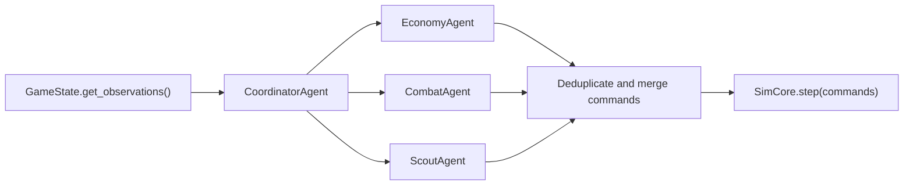
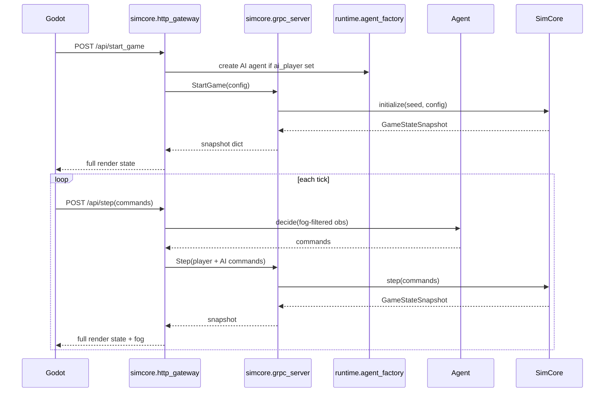
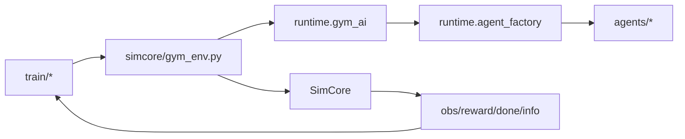
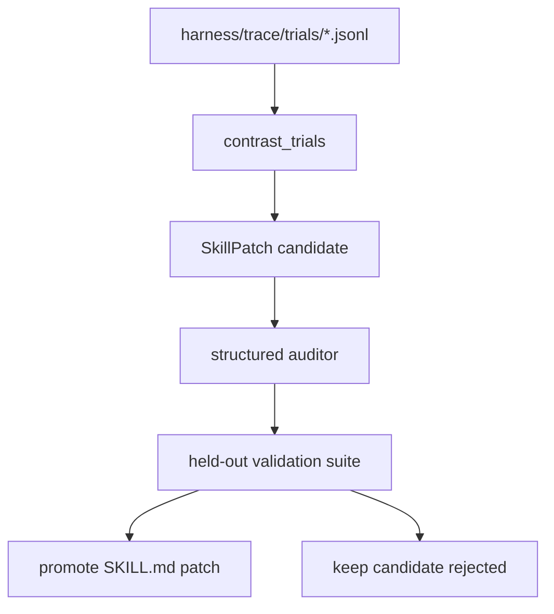

# Current Platform Architecture Report

**Date:** 2026-06-10  
**Scope:** RTS-AI-Platform current codebase, platform-side design, runtime agents, dev-side agents, Godot frontend, harness, training loop, dashboard, and SkillEvolver infrastructure.

---

## Executive Summary

RTS-AI-Platform is no longer only a four-layer game prototype. The current repository has evolved into a mixed research platform with three connected but different tracks:

1. **Runtime RTS stack:** protobuf protocol, Python SimCore, runtime agents, HTTP/gRPC bridge, Godot frontend.
2. **Research platform stack:** Gym wrapper, rollout/training modules, league, benchmark, promotion gate, replay/telemetry output.
3. **Development automation stack:** `.agents/skills`, harness traces, SkillEvolver, Hermes/Codex execution evidence, devops-harness scripts.

The intended invariant is still correct:

```text
Proto(L0) -> SimCore(L1) -> Agents/Runtime(L2) -> Frontend/Godot(L3)
```

But the current implementation has some drift:

- `scripts/lint_deps.py simcore/ agents/ runtime/ proto/` currently fails because `simcore/http_gateway.py` imports `agents.script_ai` from L1.
- `agentscope_compat` is used by runtime agent tests and code, but no repository file with that name is present.
- `godot/project.godot` advertises Godot feature `4.6`, while project documentation still says Godot 4.4/4.4.1.
- `platform/dashboard` exists but currently uses mock data only.
- Several runtime dependencies used by code, such as `aiohttp` and `gymnasium`, are not declared in `pyproject.toml`.

The platform direction is sound, but the next architecture cleanup should focus on turning implicit boundaries into explicit interfaces.

---

## Repository Map

| Area | Path | Current Role |
|---|---|---|
| Protocol | `proto/` | Protobuf/gRPC contracts for observations, commands, service, state snapshots. |
| SimCore | `simcore/` | Deterministic tick engine, game state, rules, economy, construction, spells, upgrades, gRPC/HTTP serving. |
| Runtime agents | `agents/`, `runtime/` | Baseline AI, Coordinator/Economy/Combat/Scout split, runtime factory, Gym AI injection. |
| Godot frontend | `godot/` | Godot scenes, GDScript UI, rendering, input, VFX, fog, manifest-driven SC1 presentation mapping. |
| Data | `data/` | Units, buildings, spells, upgrades, damage matrix. |
| Training | `train/`, `simcore/gym_env.py` | Gymnasium env, PPO/GRPO style trainers, rollout buffer, training outputs. |
| Harness | `harness/` | Match pool, benchmark, league, promotion gate, telemetry, skill registry, trace, SkillEvolver. |
| Platform UI | `platform/dashboard/` | React/Vite dashboard skeleton with match list/detail mock pages. |
| Dev agents | `.agents/skills/` | Role and team skills for Godot, SimCore, AI, balance, release, gate checks. |
| Scripts | `scripts/` | Verification, smoke tests, benchmark, replay generation, Godot presentation validation. |
| Docs | `docs/` | Architecture, milestones, execution plans, SC1 replication, verification guides. |

---

## Architecture Layers

### L0: Protocol

**Files:**

- `proto/service.proto`
- `proto/obs.proto`
- `proto/cmd.proto`
- `proto/state.proto`
- generated Python bindings under `simcore/proto_out/proto/`

**Responsibilities:**

- Define cross-layer service calls: `StartGame`, `Step`, `GetState`, `GetReplay`, `Health`.
- Define command payloads: move, attack, build, gather, research, train, stop.
- Define observations: world, local, fog, resource, visible entities.
- Define replay/state snapshots.

**Current assessment:**

The protocol exists and is used by `simcore/grpc_server.py` and `simcore/grpc_client.py`. Internally, many paths still exchange Python dicts rather than generated protobuf classes. That is acceptable for current iteration, but the boundary should be documented as:

- protobuf is the external contract,
- dict is the internal Python transport representation,
- conversion happens at gRPC/HTTP boundaries.

### L1: SimCore

**Key files:**

- `simcore/engine.py`
- `simcore/state.py`
- `simcore/rules.py`
- `simcore/economy.py`
- `simcore/construction.py`
- `simcore/spells.py`
- `simcore/upgrades.py`
- `simcore/grpc_server.py`
- `simcore/http_gateway.py`

**Responsibilities:**

- Deterministic tick loop.
- Immutable `GameState` snapshots.
- Movement, collision, combat, economy, construction, production, spells, upgrades.
- Fog-of-war visibility and cloak/detection filtering.
- Replay recording and snapshot serving.
- gRPC and HTTP access.

**Current assessment:**

SimCore is the most mature part of the project. It has tests for engine, state, fog, combat, replay, hash, order queue, gas loop, cloak, morph, benchmark, and Gym wrapper. The main architectural issue is that `simcore/http_gateway.py` currently has an L1 to L2 fallback import:

```text
simcore/http_gateway.py:76 from agents.script_ai (L2) in L1
```

That violates the architecture rule. The intended fix is already present conceptually through `runtime/agent_factory.py`; the gateway should require injected `agent_factory` or return a clear error when no factory is configured.

### L2: Runtime Agents

**Key files:**

- `agents/script_ai.py`
- `agents/coordinator.py`
- `agents/sub_agents.py`
- `agents/economy.py`
- `agents/combat.py`
- `agents/scout.py`
- `agents/race_ai_base.py`
- `agents/react_adapter.py`
- `agents/game_loop.py`
- `runtime/agent_factory.py`
- `runtime/auto_step.py`
- `runtime/gym_ai.py`

**Runtime architecture:**



**Current assessment:**

The runtime agent design has a good progression path:

- M0: `ScriptAI` baseline.
- M1: `CoordinatorAgent` delegates to economy, combat, scout.
- LLM adapter exists through `ReactGameAgent`, but it falls back to heuristics and should stay outside high-frequency production loops.

The risk is dependency clarity:

- `agentscope_compat` is imported in `agents/coordinator.py`, `agents/react_adapter.py`, `agents/game_loop.py`, and tests, but it is not visible as a repository file.
- The project docs describe AgentScope, but `pyproject.toml` only includes `agentscope>=0.1` in optional dependencies and does not define the compatibility shim.

The short-term decision should be either:

1. vendor a minimal `agentscope_compat.py` into the repo, or
2. formally depend on a package that provides it, and document how agents import it.

### L3: Godot Frontend

**Key files:**

- `godot/project.godot`
- `godot/scenes/main_menu.tscn`
- `godot/scenes/game_view.tscn`
- `godot/scenes/hud.tscn`
- `godot/scripts/grpc_bridge.gd`
- `godot/scripts/game_view.gd`
- `godot/scripts/hud.gd`
- `godot/scripts/sprite_loader.gd`
- `godot/scripts/vfx_manager.gd`
- `godot/resources/presentation_manifest.json`
- `godot/resources/sprite_frames_config.json`
- `godot/resources/vfx/vfx_catalog.json`

**Responsibilities:**

- Display SimCore state.
- Send user commands through HTTP gateway.
- Render fog, minimap, health bars, selection rings, VFX.
- Map abstract SimCore units/buildings to SC1-inspired visual IDs through manifest files.

**Current assessment:**

Godot is currently an active productization layer, not a thin toy shell. It contains UI, controls, replay overlay, race-aware HUD, VFX, fog smoothing, sprite atlas mapping, and SC1 presentation mapping.

The biggest architectural risk is drift between:

- data in `data/*`,
- runtime entity names in SimCore,
- Godot manifest names,
- sprite atlas rectangles,
- manually documented SC1 catalog.

The new SC1 completeness plan should become the authoritative coverage ledger for this gap.

---

## Platform-Side Architecture

### Harness

**Key files:**

- `harness/pool.py`
- `harness/benchmark.py`
- `harness/league.py`
- `harness/promotion.py`
- `harness/telemetry.py`
- `harness/output/*`

**Current role:**

Harness provides batch simulation, match scheduling, benchmark stats, league versioning, ELO updates, promotion gates, telemetry, replay analysis, and output artifacts.

**Current assessment:**

Harness is the correct place for research validation and platform acceptance. It should be treated as the layer that turns gameplay changes into measurable evidence:

- determinism,
- win rate,
- illegal action rate,
- crash rate,
- replay reproducibility,
- promotion confidence.

### SkillEvolver

**Key files:**

- `harness/skills/registry.json`
- `harness/skills/schema.json`
- `harness/trace/schema.py`
- `harness/trace/validate_traces.py`
- `harness/evolve/skill_evolver.py`
- `harness/evolve/auditor.py`
- `.agents/skills/*/SKILL.md`

**Current role:**

SkillEvolver is development automation infrastructure. It is not a runtime RTS AI system. It performs:

```text
explore -> contrast pass/fail traces -> generate skill patch -> audit -> held-out validation -> promote/rollback
```

**Current assessment:**

The design is aligned with the paper-driven direction: evidence, contrastive trace analysis, structured audit, held-out validation, and manual promotion. The important safety boundary is:

- SkillEvolver may patch `.agents/skills/*` and harness metadata.
- SkillEvolver must not directly patch SimCore/Godot business logic as part of skill evolution.
- Business-code changes must go through a normal implementation task and tests.

### Platform Dashboard

**Key files:**

- `platform/dashboard/package.json`
- `platform/dashboard/src/main.tsx`
- `platform/dashboard/src/pages/MatchesPage.tsx`
- `platform/dashboard/src/pages/MatchDetailPage.tsx`

**Current role:**

The dashboard is a React/Vite skeleton. It currently shows mock match rows and mock match detail JSON.

**Current assessment:**

The dashboard direction is correct for Agent Ops, but it is not yet integrated with harness outputs or HTTP APIs. Its next architecture step should be:

1. define a backend API contract for match list, match detail, replay ticks, league ranking, training runs,
2. implement static file/read-only adapters over `harness/output/`,
3. replace mock data with API calls,
4. add streaming only after the read-only path is stable.

### Training

**Key files:**

- `simcore/gym_env.py`
- `train/rl_trainer.py`
- `train/grpo_trainer.py`
- `train/rollout_worker.py`
- `train/league_train.py`
- `train/shared_buffer.py`
- `train/output/*`

**Current role:**

The training stack wraps SimCore in Gymnasium-style observations/actions, supports PPO/GRPO-style loops, and produces output checkpoints and curves.

**Current assessment:**

The training direction is coherent, but dependencies and operational contracts need hardening:

- `gymnasium` is imported but not declared in `pyproject.toml`.
- `torch` is optional and handled gracefully, but production training should pin the expected install profile.
- `train/output/*` includes generated model artifacts and reports; repository policy should decide what is source-controlled.

---

## Runtime Data Flows

### Human vs AI in Godot



### Headless Training



### Skill Evolution



---

## Architecture Status Matrix

| Capability | Status | Evidence | Notes |
|---|---|---|---|
| Four-layer intent | Strong | `AGENTS.md`, `docs/architecture/four-layers.md` | Concept is consistent. |
| Four-layer enforcement | Concern | `scripts/lint_deps.py` fails | `simcore/http_gateway.py` L1->L2 fallback import. |
| Deterministic SimCore | Strong | tests under `tests/simcore/` | Hash/replay/order/economy tests exist. |
| Runtime M1 agents | Partial | `agents/coordinator.py`, `agents/sub_agents.py` | Functional split exists; compat shim unclear. |
| LLM runtime agent | Experimental | `agents/react_adapter.py` | Must stay low-frequency/offline or fallback-only. |
| Godot frontend | Active | `godot/scripts/game_view.gd`, manifest validators | Product-facing, but visual/data alignment still unstable. |
| SC1 resource parity | Partial | `docs/plans/2026-06-08-sc1-completeness-validation-plan.md` | Needs coverage ledger and audit scripts. |
| Harness benchmark/league | Partial | `harness/pool.py`, `harness/league.py`, `harness/promotion.py` | Code exists; dashboard integration pending. |
| SkillEvolver | Partial with blockers | `docs/plans/skill-evolver-paper-alignment-report.md` | Registry/traces pass, final gate blocked by lint/Godot held-out issues. |
| Dashboard | Skeleton | `platform/dashboard/src/pages/*` | Mock data only. |

---

## Known Architecture Risks

### P0: Layer Violation in HTTP Gateway

Current command:

```bash
python3 scripts/lint_deps.py simcore/ agents/ runtime/ proto/
```

Current result:

```text
simcore/http_gateway.py:76 from agents.script_ai (L2) in L1 — forbidden
```

**Fix direction:** remove the fallback import and make `runtime.agent_factory` the only legal AI injection path.

### P0: Implicit AgentScope Compatibility Dependency

`agentscope_compat` is imported but not present in the repository. This creates hidden environment coupling.

**Fix direction:** add a repository-owned compatibility shim or formal dependency documentation.

### P1: Godot Version Drift

`AGENTS.md` and historical docs refer to Godot 4.4.1. `godot/project.godot` declares:

```text
config/features=PackedStringArray("4.6", "Forward Plus")
```

**Fix direction:** choose one supported Godot version and update all docs, CI/check-only workflow, and local validation commands.

### P1: Dependency Declaration Drift

Current code imports packages not declared in `pyproject.toml`, including:

- `aiohttp`
- `gymnasium`

**Fix direction:** add runtime optional dependency groups, for example `server`, `train`, `agents`, and document install commands.

### P1: Dashboard Is Not Connected to Harness

The dashboard is useful as a product direction but cannot yet validate experiments.

**Fix direction:** implement a read-only platform API over `harness/output/` before building live WebSocket streaming.

### P1: SC1 Data/Resource/Implementation Gap

The project has unit/building/spell/upgrade data and Godot manifests, but no canonical coverage ledger yet.

**Fix direction:** execute `docs/plans/2026-06-08-sc1-completeness-validation-plan.md`.

### P2: Generated Artifacts in Working Tree

Training outputs, Godot cache files, proto outputs, harness outputs, and candidate patches appear in the worktree.

**Fix direction:** decide source vs artifact policy and update `.gitignore` accordingly.

---

## Recommended Architecture Iteration Order

1. **Restore architecture lint to green.** Fix `simcore/http_gateway.py` so L1 does not import L2.
2. **Clarify runtime agent compatibility layer.** Add or document `agentscope_compat`.
3. **Pin platform dependency groups.** Separate base, server, train, agents, dashboard, Godot verification dependencies.
4. **Make SC1 completeness ledger the source of truth.** Stop relying on rough roadmap percentages.
5. **Connect dashboard read-only to harness output.** Start with match list, replay list, league ranking, promotion history.
6. **Promote Godot manifest validation to required gate.** Keep visual fixes in manifest/resource layer before touching SimCore rules.
7. **Keep SkillEvolver promotion manual until held-out suites are stable.** Use it as evidence tooling, not automatic production mutation.

---

## Validation Commands

Use these commands when assessing architecture health:

```bash
python3 scripts/lint_deps.py simcore/ agents/ runtime/ proto/
python3 harness/skills/validate_registry.py
python3 harness/trace/validate_traces.py --strict
python3 scripts/verify_presentation_scene.py
python3 -m pytest tests/simcore/ -q -x
python3 -m pytest tests/agents/ -q -x
python3 -m pytest tests/harness/ -q -x
python3 -m pytest tests/godot/ -q -x
```

For Godot playtesting:

```bash
python3 -m simcore.grpc_server --port 50051
python3 -m simcore.http_gateway --grpc-port 50051 --http-port 8080
/Applications/Godot.app/Contents/MacOS/Godot --path godot
```

For dashboard:

```bash
cd platform/dashboard
npm run dev
```

---

## Architecture Decision To Make Next

The next formal ADR should answer:

**Should `simcore/http_gateway.py` remain inside L1, or should HTTP serving move to `runtime/` as an L2 platform adapter?**

Recommendation:

- Keep `simcore/grpc_server.py` as L1 serving because it exposes SimCore directly.
- Move AI-aware HTTP orchestration to `runtime/http_gateway.py` or make the existing gateway fully factory-injected.
- Treat Godot HTTP as a frontend adapter, not core simulation logic.

