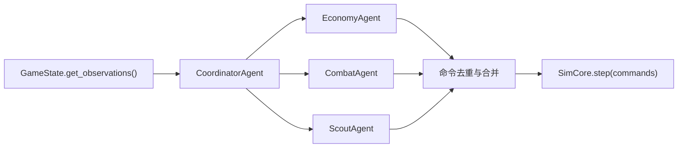
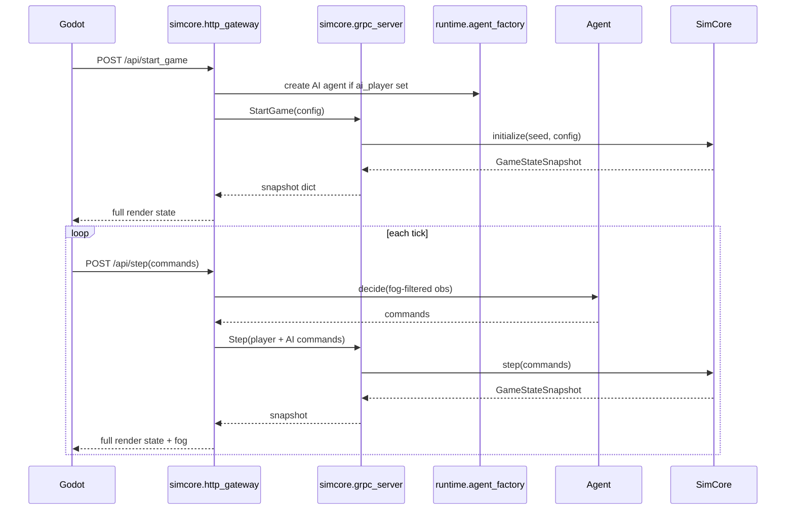
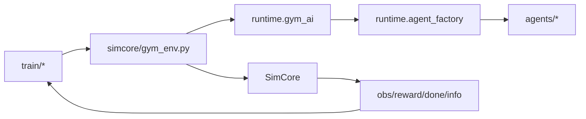
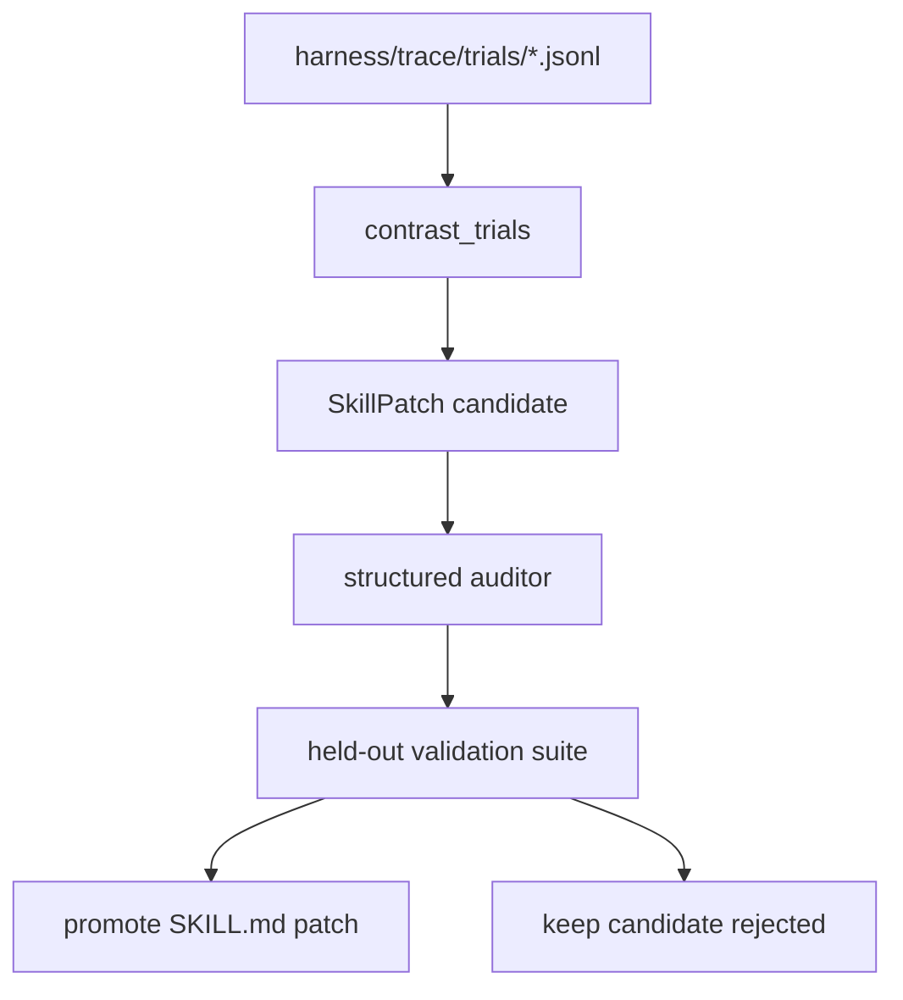

# 当前平台架构报告

**日期：** 2026-06-10  
**范围：** RTS-AI-Platform 当前代码库、平台侧设计、运行时 Agent、研发侧 Agent、Godot 前端、Harness、训练闭环、Dashboard 与 SkillEvolver 基础设施。

---

## 摘要

RTS-AI-Platform 现在已经不只是一个四层游戏原型。当前仓库已经演进成一个混合型研究平台，包含三条相互连接但目标不同的轨道：

1. **运行时 RTS 栈：** protobuf 协议、Python SimCore、运行时 Agent、HTTP/gRPC 桥接、Godot 前端。
2. **研究平台栈：** Gym 封装、rollout/训练模块、league、benchmark、promotion gate、replay/telemetry 输出。
3. **研发自动化栈：** `.agents/skills`、harness trace、SkillEvolver、Hermes/Codex 执行证据、devops-harness 脚本。

目标架构不变量仍然是正确的：

```text
Proto(L0) -> SimCore(L1) -> Agents/Runtime(L2) -> Frontend/Godot(L3)
```

但当前实现已经出现一些偏移：

- `scripts/lint_deps.py simcore/ agents/ runtime/ proto/` 当前失败，因为 `simcore/http_gateway.py` 在 L1 中导入了 `agents.script_ai`。
- 运行时 agent 测试和代码使用了 `agentscope_compat`，但仓库中没有对应文件。
- `godot/project.godot` 声明 Godot feature 为 `4.6`，而项目文档仍写 Godot 4.4/4.4.1。
- `platform/dashboard` 已存在，但目前只使用 mock 数据。
- 代码使用的一些运行时依赖，例如 `aiohttp` 和 `gymnasium`，没有在 `pyproject.toml` 中声明。

平台方向是合理的，但下一轮架构清理应该重点把隐式边界转成显式接口。

---

## 仓库结构图

| 区域 | 路径 | 当前职责 |
|---|---|---|
| 协议层 | `proto/` | Observation、Command、Service、State Snapshot 的 Protobuf/gRPC 合约。 |
| SimCore | `simcore/` | 确定性 tick 引擎、游戏状态、规则、经济、建造、技能、升级、gRPC/HTTP 服务。 |
| 运行时 Agent | `agents/`, `runtime/` | 基线 AI、Coordinator/Economy/Combat/Scout 拆分、runtime factory、Gym AI 注入。 |
| Godot 前端 | `godot/` | Godot 场景、GDScript UI、渲染、输入、VFX、战争迷雾、manifest 驱动的 SC1 表现映射。 |
| 数据 | `data/` | 单位、建筑、技能、升级、伤害矩阵。 |
| 训练 | `train/`, `simcore/gym_env.py` | Gymnasium 环境、PPO/GRPO 风格训练器、rollout buffer、训练输出。 |
| Harness | `harness/` | 对局池、benchmark、league、promotion gate、telemetry、skill registry、trace、SkillEvolver。 |
| 平台 UI | `platform/dashboard/` | React/Vite dashboard 骨架，包含对局列表和详情 mock 页面。 |
| 研发侧 Agent | `.agents/skills/` | 面向 Godot、SimCore、AI、平衡、发布、阶段门控的角色和团队 skill。 |
| 脚本 | `scripts/` | 校验、smoke test、benchmark、replay 生成、Godot 表现校验。 |
| 文档 | `docs/` | 架构、里程碑、执行计划、SC1 复刻、验证指南。 |

---

## 架构层

### L0：协议层

**文件：**

- `proto/service.proto`
- `proto/obs.proto`
- `proto/cmd.proto`
- `proto/state.proto`
- `simcore/proto_out/proto/` 下生成的 Python binding

**职责：**

- 定义跨层服务调用：`StartGame`、`Step`、`GetState`、`GetReplay`、`Health`。
- 定义命令 payload：move、attack、build、gather、research、train、stop。
- 定义 observation：world、local、fog、resource、visible entities。
- 定义 replay/state snapshot。

**当前评估：**

协议已经存在，并被 `simcore/grpc_server.py` 和 `simcore/grpc_client.py` 使用。内部很多路径仍然使用 Python dict 交换数据，而不是直接传递生成的 protobuf class。以当前迭代阶段来看这是可接受的，但边界应该被明确记录为：

- protobuf 是外部合约；
- dict 是 Python 内部传输表示；
- gRPC/HTTP 边界负责转换。

### L1：SimCore

**关键文件：**

- `simcore/engine.py`
- `simcore/state.py`
- `simcore/rules.py`
- `simcore/economy.py`
- `simcore/construction.py`
- `simcore/spells.py`
- `simcore/upgrades.py`
- `simcore/grpc_server.py`
- `simcore/http_gateway.py`

**职责：**

- 确定性 tick 循环。
- 不可变 `GameState` 快照。
- 移动、碰撞、战斗、经济、建造、生产、技能、升级。
- 战争迷雾可见性与隐身/反隐过滤。
- Replay 记录与 snapshot 服务。
- gRPC 和 HTTP 访问。

**当前评估：**

SimCore 是项目中最成熟的部分。它已经覆盖 engine、state、fog、combat、replay、hash、order queue、gas loop、cloak、morph、benchmark 和 Gym wrapper 等测试。主要架构问题是 `simcore/http_gateway.py` 当前存在 L1 到 L2 的 fallback import：

```text
simcore/http_gateway.py:76 from agents.script_ai (L2) in L1
```

这违反了架构规则。目标修复方向已经通过 `runtime/agent_factory.py` 在概念上存在：gateway 应该要求注入 `agent_factory`，或者在没有配置 factory 时返回明确错误。

### L2：运行时 Agent

**关键文件：**

- `agents/script_ai.py`
- `agents/coordinator.py`
- `agents/sub_agents.py`
- `agents/economy.py`
- `agents/combat.py`
- `agents/scout.py`
- `agents/race_ai_base.py`
- `agents/react_adapter.py`
- `agents/game_loop.py`
- `runtime/agent_factory.py`
- `runtime/auto_step.py`
- `runtime/gym_ai.py`

**运行时架构：**



**当前评估：**

运行时 Agent 设计有清晰的渐进路径：

- M0：`ScriptAI` 基线。
- M1：`CoordinatorAgent` 委派给 economy、combat、scout。
- 通过 `ReactGameAgent` 提供了 LLM adapter，但它有 heuristic fallback，并且应该保持在高频生产循环之外。

当前风险主要是依赖边界不清晰：

- `agents/coordinator.py`、`agents/react_adapter.py`、`agents/game_loop.py` 和测试中导入了 `agentscope_compat`，但仓库里看不到这个文件。
- 项目文档描述了 AgentScope，但 `pyproject.toml` 只在 optional dependencies 中包含 `agentscope>=0.1`，没有定义 compatibility shim。

短期需要做一个明确决策：

1. 把一个最小版 `agentscope_compat.py` 放入仓库；或
2. 正式依赖提供该 shim 的包，并文档化 agent 如何导入它。

### L3：Godot 前端

**关键文件：**

- `godot/project.godot`
- `godot/scenes/main_menu.tscn`
- `godot/scenes/game_view.tscn`
- `godot/scenes/hud.tscn`
- `godot/scripts/grpc_bridge.gd`
- `godot/scripts/game_view.gd`
- `godot/scripts/hud.gd`
- `godot/scripts/sprite_loader.gd`
- `godot/scripts/vfx_manager.gd`
- `godot/resources/presentation_manifest.json`
- `godot/resources/sprite_frames_config.json`
- `godot/resources/vfx/vfx_catalog.json`

**职责：**

- 展示 SimCore 状态。
- 通过 HTTP gateway 发送用户命令。
- 渲染战争迷雾、小地图、血条、选择环、VFX。
- 通过 manifest 文件把 SimCore 抽象单位/建筑映射到 SC1-inspired 视觉 ID。

**当前评估：**

Godot 当前已经是活跃的产品化层，而不是简单的薄展示壳。它包含 UI、控制、replay overlay、种族感知 HUD、VFX、fog smoothing、sprite atlas mapping 和 SC1 presentation mapping。

最大的架构风险是以下内容之间发生漂移：

- `data/*` 中的数据；
- SimCore 运行时实体名；
- Godot manifest 名称；
- sprite atlas 裁剪矩形；
- 手动维护的 SC1 catalog 文档。

新的 SC1 完整性计划应该成为这类 gap 的权威覆盖账本。

---

## 平台侧架构

### Harness

**关键文件：**

- `harness/pool.py`
- `harness/benchmark.py`
- `harness/league.py`
- `harness/promotion.py`
- `harness/telemetry.py`
- `harness/output/*`

**当前角色：**

Harness 提供批量仿真、对局调度、benchmark stats、league 版本管理、ELO 更新、promotion gate、telemetry、replay 分析和输出 artifact。

**当前评估：**

Harness 是研究验证和平台验收的正确位置。它应该被视为把 gameplay 变更转化为可度量证据的层：

- 确定性；
- 胜率；
- 非法动作率；
- crash 率；
- replay 可复现性；
- promotion 置信度。

### SkillEvolver

**关键文件：**

- `harness/skills/registry.json`
- `harness/skills/schema.json`
- `harness/trace/schema.py`
- `harness/trace/validate_traces.py`
- `harness/evolve/skill_evolver.py`
- `harness/evolve/auditor.py`
- `.agents/skills/*/SKILL.md`

**当前角色：**

SkillEvolver 是研发自动化基础设施。它不是运行时 RTS AI 系统。它执行：

```text
explore -> contrast pass/fail traces -> generate skill patch -> audit -> held-out validation -> promote/rollback
```

**当前评估：**

该设计与论文驱动方向一致：证据、contrastive trace analysis、structured audit、held-out validation 和人工 promotion。关键安全边界是：

- SkillEvolver 可以 patch `.agents/skills/*` 和 harness metadata。
- SkillEvolver 不能在 skill evolution 过程中直接 patch SimCore/Godot 业务逻辑。
- 业务代码变更必须走正常实现任务和测试。

### Platform Dashboard

**关键文件：**

- `platform/dashboard/package.json`
- `platform/dashboard/src/main.tsx`
- `platform/dashboard/src/pages/MatchesPage.tsx`
- `platform/dashboard/src/pages/MatchDetailPage.tsx`

**当前角色：**

Dashboard 是 React/Vite 骨架。目前展示 mock match rows 和 mock match detail JSON。

**当前评估：**

Dashboard 作为 Agent Ops 的产品方向是正确的，但它尚未和 harness output 或 HTTP API 集成。下一步架构工作应该是：

1. 定义 match list、match detail、replay ticks、league ranking、training runs 的后端 API 合约；
2. 在 `harness/output/` 上实现静态文件/只读 adapter；
3. 用 API 调用替换 mock 数据；
4. 等只读路径稳定后，再添加 streaming。

### Training

**关键文件：**

- `simcore/gym_env.py`
- `train/rl_trainer.py`
- `train/grpo_trainer.py`
- `train/rollout_worker.py`
- `train/league_train.py`
- `train/shared_buffer.py`
- `train/output/*`

**当前角色：**

训练栈将 SimCore 封装成 Gymnasium 风格的 observation/action，支持 PPO/GRPO 风格循环，并产出 checkpoint 和曲线。

**当前评估：**

训练方向是连贯的，但依赖和运行合约需要加固：

- 代码导入了 `gymnasium`，但 `pyproject.toml` 没有声明。
- `torch` 是 optional，并有 graceful fallback，但生产训练应该 pin 清楚期望安装 profile。
- `train/output/*` 包含生成的模型 artifact 和报告，仓库策略需要明确哪些应纳入版本控制。

---

## 运行时数据流

### Godot 中的人类 vs AI



### Headless Training



### Skill Evolution



---

## 架构状态矩阵

| 能力 | 状态 | 证据 | 备注 |
|---|---|---|---|
| 四层架构意图 | 强 | `AGENTS.md`, `docs/architecture/four-layers.md` | 概念一致。 |
| 四层架构执行 | 有风险 | `scripts/lint_deps.py` 失败 | `simcore/http_gateway.py` 存在 L1->L2 fallback import。 |
| 确定性 SimCore | 强 | `tests/simcore/` 下的测试 | 已有 hash/replay/order/economy 测试。 |
| 运行时 M1 Agent | 部分完成 | `agents/coordinator.py`, `agents/sub_agents.py` | 功能拆分存在；compat shim 不清晰。 |
| LLM 运行时 Agent | 实验态 | `agents/react_adapter.py` | 必须保持低频/离线或 fallback-only。 |
| Godot 前端 | 活跃 | `godot/scripts/game_view.gd`, manifest validators | 已面向产品表现，但视觉/数据对齐仍不稳定。 |
| SC1 资源复刻度 | 部分完成 | `docs/plans/2026-06-08-sc1-completeness-validation-plan.md` | 需要 coverage ledger 和 audit scripts。 |
| Harness benchmark/league | 部分完成 | `harness/pool.py`, `harness/league.py`, `harness/promotion.py` | 代码存在；dashboard 集成待完成。 |
| SkillEvolver | 部分完成且有阻塞 | `docs/plans/skill-evolver-paper-alignment-report.md` | Registry/trace 通过；最终 gate 被 lint/Godot held-out 问题阻塞。 |
| Dashboard | 骨架 | `platform/dashboard/src/pages/*` | 仅 mock 数据。 |

---

## 已知架构风险

### P0：HTTP Gateway 层级违规

当前命令：

```bash
python3 scripts/lint_deps.py simcore/ agents/ runtime/ proto/
```

当前结果：

```text
simcore/http_gateway.py:76 from agents.script_ai (L2) in L1 — forbidden
```

**修复方向：** 移除 fallback import，让 `runtime.agent_factory` 成为唯一合法的 AI 注入路径。

### P0：隐式 AgentScope Compatibility 依赖

代码导入了 `agentscope_compat`，但仓库中不存在该文件。这会造成隐藏的环境耦合。

**修复方向：** 添加仓库内自有 compatibility shim，或正式文档化对应外部依赖。

### P1：Godot 版本漂移

`AGENTS.md` 和历史文档写的是 Godot 4.4.1。`godot/project.godot` 声明：

```text
config/features=PackedStringArray("4.6", "Forward Plus")
```

**修复方向：** 选择一个受支持的 Godot 版本，并更新所有文档、CI/check-only 工作流和本地验证命令。

### P1：依赖声明漂移

当前代码导入了一些没有在 `pyproject.toml` 中声明的包，包括：

- `aiohttp`
- `gymnasium`

**修复方向：** 增加运行时 optional dependency groups，例如 `server`、`train`、`agents`，并文档化安装命令。

### P1：Dashboard 尚未连接 Harness

Dashboard 作为产品方向有价值，但目前还不能用于验证实验。

**修复方向：** 在构建实时 WebSocket streaming 前，先实现基于 `harness/output/` 的只读平台 API。

### P1：SC1 数据/资源/实现 Gap

项目已有 unit/building/spell/upgrade 数据和 Godot manifest，但还没有 canonical coverage ledger。

**修复方向：** 执行 `docs/plans/2026-06-08-sc1-completeness-validation-plan.md`。

### P2：工作区中的生成物

训练输出、Godot cache 文件、proto outputs、harness outputs 和 candidate patches 都出现在工作区中。

**修复方向：** 明确 source 与 artifact 策略，并相应更新 `.gitignore`。

---

## 推荐架构迭代顺序

1. **恢复 architecture lint 到绿色。** 修复 `simcore/http_gateway.py`，确保 L1 不导入 L2。
2. **明确运行时 Agent compatibility 层。** 添加或文档化 `agentscope_compat`。
3. **固定平台依赖分组。** 拆分 base、server、train、agents、dashboard、Godot verification 依赖。
4. **让 SC1 completeness ledger 成为唯一事实源。** 不再依赖粗略 roadmap 百分比。
5. **将 dashboard 只读连接到 harness output。** 从 match list、replay list、league ranking、promotion history 开始。
6. **把 Godot manifest validation 提升为必跑 gate。** 视觉修复优先放在 manifest/resource 层，避免先动 SimCore 规则。
7. **在 held-out suites 稳定前，保持 SkillEvolver 人工 promotion。** 把它作为证据工具，而不是自动生产变更工具。

---

## 验证命令

评估架构健康度时使用这些命令：

```bash
python3 scripts/lint_deps.py simcore/ agents/ runtime/ proto/
python3 harness/skills/validate_registry.py
python3 harness/trace/validate_traces.py --strict
python3 scripts/verify_presentation_scene.py
python3 -m pytest tests/simcore/ -q -x
python3 -m pytest tests/agents/ -q -x
python3 -m pytest tests/harness/ -q -x
python3 -m pytest tests/godot/ -q -x
```

Godot 试玩验证：

```bash
python3 -m simcore.grpc_server --port 50051
python3 -m simcore.http_gateway --grpc-port 50051 --http-port 8080
/Applications/Godot.app/Contents/MacOS/Godot --path godot
```

Dashboard：

```bash
cd platform/dashboard
npm run dev
```

---

## 下一个需要做的架构决策

下一个正式 ADR 应该回答：

**`simcore/http_gateway.py` 是否应该继续留在 L1，还是 HTTP serving 应该移动到 `runtime/`，作为 L2 平台 adapter？**

建议：

- 保留 `simcore/grpc_server.py` 作为 L1 服务，因为它直接暴露 SimCore。
- 将 AI-aware HTTP orchestration 移到 `runtime/http_gateway.py`，或者让现有 gateway 完全通过 factory 注入。
- 把 Godot HTTP 视为前端 adapter，而不是核心仿真逻辑。

