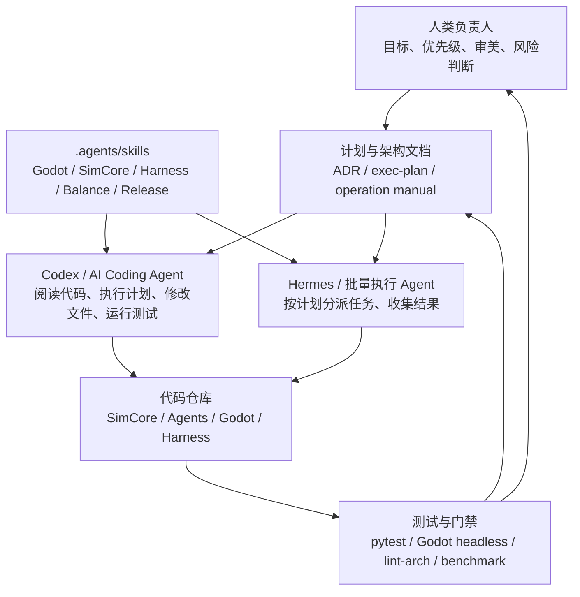
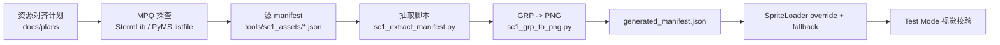
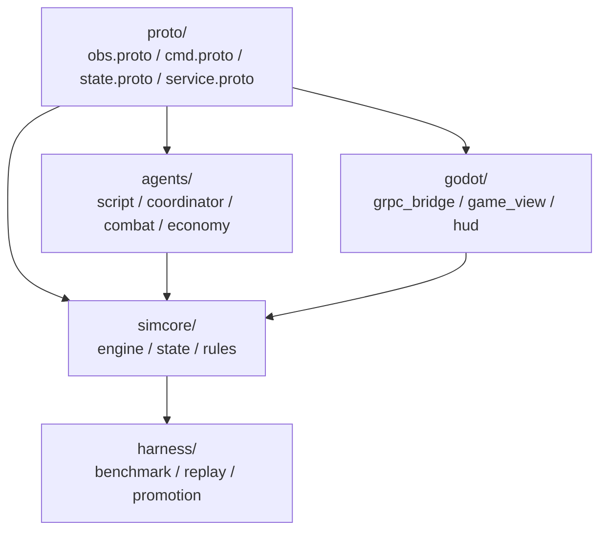
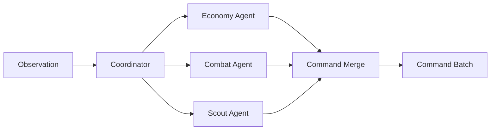
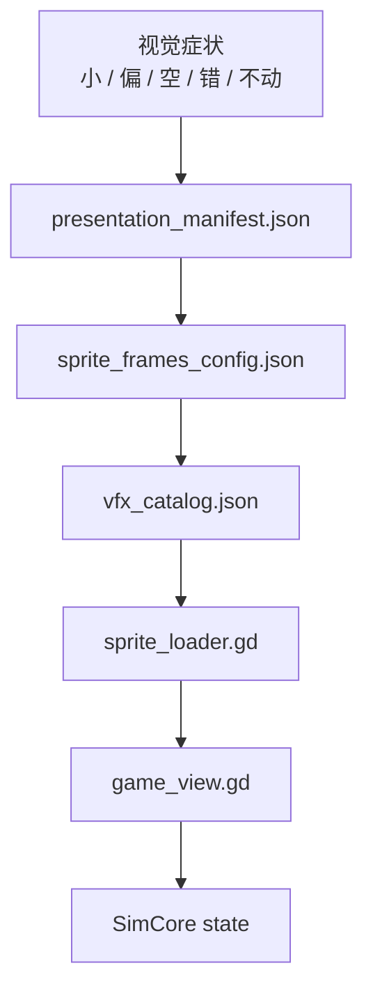
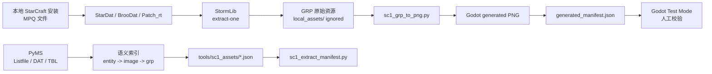
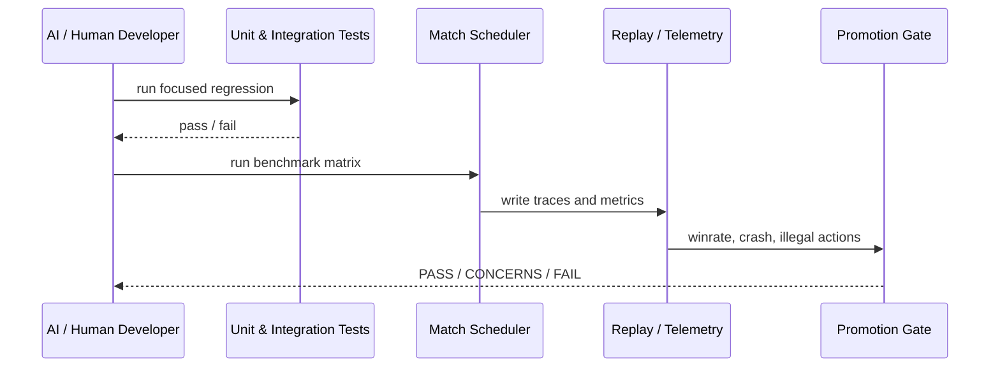
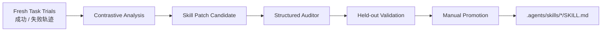

# 用 AI 工具把一个 RTS 研究平台从 0 做到 1：方法、架构与实战路径

> 这不是一篇“AI 会不会替代程序员”的泛泛讨论。  
> 这是一篇工程复盘：如何把一个复杂 RTS AI 项目拆开，交给 Codex、Hermes、专用 agent skill、测试门禁和人工架构判断共同推进。  
> 受众：科技从业者、AI 研究者、游戏工程师、多智能体系统研究者，以及正在尝试用 AI 工具构建复杂软件的人。

---

## 0. 开场：真正的问题不是让 AI 写代码，而是让 AI 进入工程系统

今天很多人使用 AI 编程工具的方式，还停留在一个危险的阶段：

“帮我写个功能。”

这句话太轻了。轻到几乎无法承载复杂项目。

因为复杂项目不是一个函数，不是一段 UI，不是一页脚本。它是一组相互牵制的约束：架构边界、状态模型、测试矩阵、资源版权、运行时性能、版本历史、回放证据、人工验收、失败复盘。AI 可以写代码，但如果没有工程方法，AI 也会很快把项目写成一团看似繁荣的泥。

RTS-AI-Platform 是一个适合讨论这个问题的案例。

它的目标很硬：做一个 AI Native 的 RTS 研究平台。底层是 Python SimCore，可无头运行、可训练、可回放；上层是 Godot 前端，负责表现、交互、战争迷雾和 SC1 风格资源；中间有 Agent 层，支持脚本 AI、多 agent 协作和未来训练；旁边还有 Harness，负责 benchmark、league、promotion gate、telemetry；更外侧则是研发自动化，包含 Hermes/Codex 执行、`.agents/skills`、SkillEvolver、trace audit 和 held-out validation。

听起来很多。

确实很多。

所以它不能靠“连续向 AI 提需求”做出来。它必须靠一套方法：把问题拆开，把职责写清，把验证做硬，把 AI 放在能发挥作用、但不能乱越界的位置。

本文讲的正是这套方法。

---

## 1. 先定义 AI 在团队里的位置

AI 工具不是一个人。

更准确地说，它是一组角色的集合：代码阅读者、执行计划生成器、局部实现者、测试补全者、审查者、文档整理者、失败复盘者。它可以切换角色，但每次切换都需要上下文、边界和验收标准。

在这个项目里，AI 工具被放进了一个分层协作框架：



这张图的重点不是“AI 很强”。重点是 AI 被包在了制度里。

人类负责目标和判断。文档负责约束。skill 负责经验。AI agent 负责执行。测试负责说真话。仓库负责留下证据。

这和 ReAct 的思想很接近：语言模型不只是生成一段答案，而是在推理和行动之间交替，观察环境，再决定下一步[^react]。区别在于，软件工程里的“环境”不是一个网页或一个游戏房间，而是整个代码库、测试系统、git 历史、运行日志和失败输出。

---

## 2. 第一步不是写代码，而是写导航图

复杂项目让 AI 失控，通常不是因为模型不会写代码，而是因为它不知道什么不能碰。

所以第一步是写 `AGENTS.md`。

它不是装饰文档。它是 AI 的地图，也是护栏。

在这个项目里，`AGENTS.md` 明确了四层架构：

| 层级 | 目录 | 可以依赖 | 禁止依赖 |
|---|---|---|---|
| L0 Proto | `proto/` | stdlib | simcore、agents、godot |
| L1 SimCore | `simcore/` | L0 | agents、godot |
| L2 Agents | `agents/` | L0、L1 | godot |
| L3 Frontend | `godot/` | L0-L2 | - |

这几行约束，比一百句“请保持架构清晰”有效。

AI 工具需要明确的负例。不能只告诉它“做得好一点”。要告诉它：SimCore 不许 import Agents；Agents 不许 import Godot；跨层通信通过 protobuf + gRPC；Godot 的视觉问题优先修 manifest，不要改 SimCore 半径；SkillEvolver 只能改 skill 和 harness metadata，不能直接 patch 业务代码。

于是第一批工程产物不是模块，而是规则：

```text
AGENTS.md
docs/architecture/four-layers.md
docs/agents/godot-agent-operation-manual.md
docs/agents/platform-harness-agent-operation-manual.md
docs/agents/skill-evolver-hermes-operation-manual.md
scripts/lint_deps.py
scripts/lint_quality.py
```

操作上可以这样做：

```bash
make lint-arch
```

这条命令的作用不是美化代码。它让 AI 也必须服从边界。

短句说：先立法。

长句说：在 AI 参与的工程系统中，架构文档、依赖检查和操作手册共同构成了一个可执行的组织记忆，避免每个新 agent 都从“读完整个世界”开始，也避免它在局部任务中无意穿透抽象层。

---

## 3. 第二步：把大目标拆成可执行计划

“做一个 RTS AI 平台”太大。

AI 听到这种需求，会倾向于铺开：写引擎，写 UI，写训练，写资源，写文档。看似勤奋，实则危险。

正确做法是先把目标拆成阶段计划。

项目里使用了几类文档：

- `docs/milestones/*`：阶段目标，例如 M0、M1、M2。
- `docs/exec-plans/*`：具体执行计划。
- `docs/plans/*`：资源、SkillEvolver、SC1 对齐等专题计划。
- `docs/agents/*`：不同 agent 的操作手册。
- `docs/reports/*`：执行后的事实报告。

一个合格的 AI 执行计划不应该只写“实现功能”。它至少要包含：

1. 当前状态；
2. 要改哪些文件；
3. 不允许改哪些文件；
4. 每一步的验收命令；
5. 失败时如何回退；
6. 产物应该提交什么，不应该提交什么；
7. 哪些问题必须人工判断。

例如 SC1 资源管线不是一句“提取资源”。它被拆成：



这就是 AI 能稳定执行的任务形态：输入清楚，输出清楚，验证清楚。

---

## 4. 第三步：让 AI 先读，再改

很多 AI 编程失败来自一个坏习惯：直接让它写。

复杂项目里，正确提示词应该先让它读。

可以这样要求：

```text
先阅读 AGENTS.md、相关 docs/agents 操作手册、目标模块代码和现有测试。
不要先提出实现。
先总结当前架构、数据流、约束和可能风险。
然后给出最小修改方案。
最后执行并跑验证。
```

这个顺序非常重要。

读代码，是为了让 AI 获得局部真实。读文档，是为了让 AI 获得全局约束。读测试，是为了让 AI 知道系统怎样说“不”。

SWE-agent 的研究指出，agent-computer interface 会显著影响语言模型解决软件工程任务的能力；对代码库导航、编辑、测试执行的接口设计，直接决定 agent 的行为质量[^swe_agent]。这和我们的工程经验一致：AI 不是只靠模型能力完成任务，它还依赖工具、文件结构、测试反馈和任务协议。

在这个项目里，一个 Godot 视觉 bug 的标准流程不是“改 game_view.gd”。Godot agent manual 明确要求先判断问题属于哪个层：

1. `presentation_manifest.json`
2. `sprite_frames_config.json`
3. `vfx_catalog.json`
4. `sprite_loader.gd`
5. `game_view.gd`
6. 测试和文档

也就是说，能改数据就别改代码。能改 manifest 就别改渲染逻辑。能用验证脚本抓住问题，就别凭截图猜。

这是一种很具体的 AI 工程方法：**把优先级写进手册，把手册变成 agent 的默认动作。**

---

## 5. 第四步：先做可复现内核，不做漂亮 demo

如果从 0 开始做这个项目，第一阶段应该让 AI 完成 SimCore 最小闭环。

目标很小：

- 两个玩家；
- 一个地图；
- 一种资源；
- 工人采集；
- 一个生产建筑；
- 一个战斗单位；
- 移动、攻击、胜负判定；
- replay 可重放。

不要做三族。

不要做漂亮 UI。

不要做复杂技能。

这一阶段给 AI 的任务可以拆成这样：

```text
任务 1：定义 state 和 entity 数据结构。
任务 2：实现 tick loop。
任务 3：实现 move / attack / gather / build 命令。
任务 4：实现 deterministic replay。
任务 5：补 pytest，验证同 seed 重放一致。
任务 6：加入 make test-core 和 lint-arch 门禁。
```

对应的验证命令：

```bash
make build
make test-core
make lint-arch
python3 -m simcore.engine
```

这里的工程判断来自强化学习环境构建的常识：环境必须稳定、可复现、可批量运行。DQN 的成功建立在大量环境交互之上[^dqn]；PPO 能广泛使用，也部分因为它在工程上相对稳定，适合迭代和大规模试验[^ppo]。如果环境本身不稳定，后面训练再漂亮也没有意义。

这一步 AI 很适合做。

因为它包含大量结构化实现：数据类、规则函数、测试用例、命令解析、边界检查。人类要做的，是不断收缩范围，拒绝“顺手加功能”。

---

## 6. 第五步：用协议把 AI、前端和仿真隔开

SimCore 跑起来之后，不要马上把 Agent 和 Godot 直接接进内部对象。

先做协议。



AI 工具在这里可以承担三类工作：

第一，生成 protobuf 草案。  
第二，补 gRPC/HTTP gateway。  
第三，写协议边界测试。

但它不能自由发挥字段。字段一旦进入协议，就会被前端、Agent、Harness 同时依赖。这里需要人工架构审查。实际操作里，可以让 AI 先给出 ADR：

```text
请为 obs/cmd/state 协议扩展写一份 ADR。
要求包含：上下文、决策、替代方案、向后兼容策略、测试方式。
不要直接改 proto。
```

等 ADR 通过，再让它改 proto 和生成代码。

这一步体现了 AI 协作里的一个重要原则：**让 AI 先写决策，再写代码。**

代码是结果。决策才是约束。

---

## 7. 第六步：让 AI 写第一个笨 AI

运行时 AI 不要一开始就做成大模型。

先写 ScriptAI。

它可以很笨：采矿，补工人，造兵，进攻，防守。它不需要像人类。它只需要稳定闭环。

给 AI 的任务要像这样：

```text
实现一个 BaselineAgent。
输入只能使用 obs 协议。
输出只能使用 cmd 协议。
不允许直接访问 SimCore GameState 内部对象。
策略优先级：生存安全 > 供给阻塞 > 经济 > 军事 > 进攻。
补测试：确保非法命令率不增加，1000 tick 内能完成采集和生产。
```

然后运行：

```bash
make test-core
python3 scripts/verify_gameplay.py
python3 scripts/run_benchmark.py
```

这一步不是为了赢。是为了建立基线。

基线是 AI 项目里的地平线。没有地平线，你不知道自己是在前进，还是只是在换一种失败方式。

之后才进入多 agent 拆分：



这和多智能体强化学习中的集中训练、分散执行问题相呼应。QMIX 用单调价值分解处理多 agent 协作，在 StarCraft micromanagement 任务上具有代表性[^qmix]。不过在工程早期，不必急着训练。先把职责拆清，指标跑通，日志打全。

---

## 8. 第七步：用 Godot 做可视化，不让 Godot 变成规则引擎

AI 很容易在前端问题上走偏。

用户说“建筑边界不对”，AI 可能去改 SimCore 半径。  
用户说“单位太小”，AI 可能去改全局 scale。  
用户说“没有战争迷雾”，AI 可能在 Godot 里自己算一套可见性。

这些都危险。

正确流程是：先确认问题属于表现层还是状态层。

Godot agent manual 把视觉问题分成几层：



AI 应该按这个顺序排查。

例如 SC1 worker 贴图不对，先查：

- abstract unit 是否映射到正确 visual ID；
- generated manifest 是否有该资源；
- `atlas_rect` 是否越界；
- `frame_width/frame_height` 是否对应 GRP；
- `render_scale` 是否由 `visual_class` 推导；
- Godot loader 是否 fallback 到旧资源。

验证命令：

```bash
python3 scripts/verify_presentation_scene.py
pytest tests/godot/ -q -x
/Applications/Godot.app/Contents/MacOS/Godot --headless --path godot --script scripts/test_p1a_sprite_loader.gd
```

如果要人工看效果，再启动后端：

```bash
python3 -m simcore.grpc_server --port 50051
python3 -m simcore.http_gateway --grpc-port 50051 --http-port 8080
/Applications/Godot.app/Contents/MacOS/Godot --path godot
```

这就是 AI + 工程方法的组合：AI 负责搜索、定位、修改；工程方法规定排查顺序；测试和截图负责最终判断。

---

## 9. 第八步：让 AI 处理资源，但不要让它猜资源

SC1 资源管线是这个项目里最典型的 AI 协作案例。

一开始的问题很具体：Godot 里的美术效果和星际争霸不对应。建筑边界漂移。工人贴图不对。神族建筑比例偏小。单位看不清。资源文件和实现之间存在 gap。

如果粗暴处理，AI 会不断调 scale、改偏移、换路径。今天看起来好一点，明天又坏。

更稳的做法是建立资源管线：



这条线里，AI 可以做很多事：

- 查开源工具：StormLib、PyMS、OpenBW、BWAPI；
- 写抽取脚本；
- 写 GRP 转 PNG；
- 生成 manifest；
- 写 pytest；
- 写 Godot loader fallback；
- 做 contact sheet；
- 对比 DAT/TBL 映射；
- 总结校验 SOP。

但有一件事不能让 AI 随便做：猜。

例如 Terran 建筑资源路径，`CommandCenter` 并不叫 `commandcenter.grp`，而是 `unit\terran\control.grp`。`Barracks` 是 `tbarrack.grp`。`SupplyDepot` 是 `depot.grp`。`ControlTower` 这类 addon 如果只看 listfile，很容易拿到 overlay 或局部组件；必须用 `images.dat`、`sprites.dat`、`images.tbl` 走链路。

这里的工程结论很明确：

```text
文件存在 != 语义正确
能显示 != 映射正确
路径猜中 != 资源对齐完成
```

所以后续给 AI 的任务应该这样写：

```text
不要继续按英文名猜 GRP。
请使用 PyMS 的 ImagesDAT、SpritesDAT、images.tbl 生成 entity -> image -> grp_path 索引。
对每个 manifest 条目，校验当前 mpq_path 是否等于 DAT/TBL 解析结果。
输出差异报告，不要先修改资源。
```

这比“帮我修贴图”强很多。

---

## 10. 第九步：用 Harness 把 AI 产出变成证据

AI 代码合不合格，不能只看 diff。

要看它有没有通过门禁。

这个项目的 Harness 负责把 gameplay 和 agent 变化变成证据：



一个标准平台验证报告应该长这样：

```markdown
# Platform Validation Report

## Scope
- Change under test:
- Branch:
- Date:

## Commands
- `pytest tests/harness/ -q -x`
- `python3 scripts/run_benchmark.py`

## Results
| Metric | Baseline | Candidate | Verdict |
|---|---:|---:|---|
| Win rate | | | |
| Crash count | | | |
| Illegal commands | | | |
| Replay mismatch | | | |

## Decision
PASS / CONCERNS / FAIL
```

这类报告非常适合 AI 生成初稿。

但最终判断必须有人类签字。因为指标可能互相冲突：胜率上升但非法动作率变高，不能算成功；单位更漂亮但帧率下降，也不能无脑合并；资源更多但 manifest 不可复现，应该阻塞。

---

## 11. 第十步：让失败变成 skill，而不是聊天记录

传统 AI 编程有一个浪费：失败只留在对话里。

下一次新 agent 来，又犯同样错误。

RTS-AI-Platform 的 SkillEvolver 试图解决这个问题。它把执行轨迹记录成 `SkillTrial`，再对比成功和失败，生成 skill patch，经过 auditor 和 held-out validation 后再 promotion。

它的循环是：



这和 Reflexion 的方向相似：语言 agent 不一定要更新模型权重，也可以通过语言化反馈和 episodic memory 改善后续表现[^reflexion]。Voyager 也展示了另一条路：让 agent 在 Minecraft 中积累可复用 skill library，从环境反馈中持续改进[^voyager]。

工程上，这一步尤其关键。

比如这次资源问题可以沉淀成 skill 规则：

- SC1 GRP 路径不能只靠英文名猜；
- 建筑和单位都可能在 `unit\<race>\` 下；
- listfile 只能证明文件存在，不能证明语义；
- DAT/TBL 才是语义映射权威来源；
- Godot `.godot/imported/` 是缓存，不应提交；
- generated manifest 必须能由源 manifest 重建。

这些经验如果只写在聊天记录里，很快就丢。写进 skill，后面的 agent 才会继承。

---

## 12. 一套可复制的 AI 工程操作流

如果把这个项目的方法抽象出来，可以得到一套通用流程。

### Step 1：定义边界

产物：

```text
AGENTS.md
docs/architecture/*.md
scripts/lint_deps.py
```

AI 使用方式：

```text
请先阅读 AGENTS.md 和架构文档。
总结当前边界。
不要修改代码。
```

验收：

```bash
make lint-arch
```

### Step 2：写执行计划

产物：

```text
docs/exec-plans/<date>-<topic>.md
docs/plans/<topic>.md
```

AI 使用方式：

```text
请把目标拆成 P0/P1/P2。
每个阶段列出文件、命令、风险、验收标准。
不要开始实现。
```

验收：

```text
人工确认范围是否过大。
人工确认是否有不可自动判断的环节。
```

### Step 3：建立最小闭环

产物：

```text
simcore/engine.py
simcore/state.py
simcore/rules.py
tests/
```

AI 使用方式：

```text
按计划实现最小可运行闭环。
每次只改一个层。
先补测试，再实现。
```

验收：

```bash
make test-core
python3 -m simcore.engine
```

### Step 4：协议化

产物：

```text
proto/obs.proto
proto/cmd.proto
proto/state.proto
simcore/grpc_server.py
simcore/http_gateway.py
```

AI 使用方式：

```text
先写 ADR。
说明为什么新增字段，如何兼容旧字段。
然后再改 proto。
```

验收：

```bash
make proto
make test-integration
```

### Step 5：接入前端

产物：

```text
godot/scripts/game_view.gd
godot/scripts/sprite_loader.gd
godot/resources/presentation_manifest.json
```

AI 使用方式：

```text
视觉问题优先查 manifest。
不要通过改 SimCore 解决视觉错位。
补 Godot headless 脚本验证。
```

验收：

```bash
python3 scripts/verify_presentation_scene.py
pytest tests/godot/ -q -x
```

### Step 6：建立资源管线

产物：

```text
tools/sc1_assets/*.json
scripts/sc1_discover_assets.py
scripts/sc1_extract_manifest.py
scripts/sc1_grp_to_png.py
godot/assets/sc1_generated/generated_manifest.json
```

AI 使用方式：

```text
先生成 inventory。
再生成 manifest。
最后转换资源。
不要提交 proprietary raw assets。
```

验收：

```bash
python3 scripts/sc1_discover_assets.py --manifest tools/sc1_assets/p1b_building_manifest.json --starcraft-dir /Users/yuyou/code/StarCraft --out /tmp/p1b.json
pytest tests/godot/test_sc1_generated_manifest.py tests/godot/test_visual_class_scale.py -q
```

### Step 7：接入 Harness

产物：

```text
harness/benchmark.py
harness/promotion.py
harness/output/*
scripts/run_benchmark.py
```

AI 使用方式：

```text
请定义 evidence question。
选择最小 seed/map/opponent 矩阵。
输出 PASS / CONCERNS / FAIL。
```

验收：

```bash
pytest tests/harness/ -q -x
python3 scripts/run_benchmark.py
```

### Step 8：复盘并演化 skill

产物：

```text
harness/trace/trials/*.jsonl
harness/skills/candidates/*
.agents/skills/*/SKILL.md
```

AI 使用方式：

```text
从失败 trace 提取共性。
生成 skill patch candidate。
auditor 不通过则拒绝。
held-out 不通过则不 promotion。
```

验收：

```bash
python3 harness/skills/validate_registry.py
python3 harness/trace/validate_traces.py --strict
pytest tests/harness/test_skill_evolver.py tests/harness/test_skill_auditor.py -q
```

---

## 13. 推荐的提示词模板

下面这些模板比“帮我实现”稳定得多。

### 架构阅读模板

```text
请先阅读 AGENTS.md、相关 docs/architecture 文档和目标模块。
输出：
1. 当前架构边界；
2. 目标功能涉及哪些层；
3. 哪些文件可以改；
4. 哪些文件不应该改；
5. 最小验证命令。
不要开始实现。
```

### 执行计划模板

```text
请把这个需求拆成 P0/P1/P2。
每个阶段必须包含：
- 目标；
- 修改文件；
- 测试命令；
- 风险；
- 人工验收点。
计划要适合其他 agent 独立执行。
```

### 实现模板

```text
按照 docs/plans/<plan>.md 执行。
保持改动范围最小。
优先沿用现有模式。
不要重构无关文件。
每完成一个阶段运行对应测试。
最后输出：修改摘要、验证结果、剩余风险。
```

### 调试模板

```text
不要直接修。
先定位根因。
列出 3 个可能原因，并用命令逐个排除。
找到根因后给出最小修复。
修复后运行回归测试。
```

### 复盘模板

```text
请根据这次任务的失败和成功记录，提炼可复用经验。
输出：
1. 失败模式；
2. 正确排查顺序；
3. 应写入哪个 skill；
4. held-out 测试建议；
5. 不应泛化的部分。
```

这些模板本质上是在把软件工程流程翻译成 AI 能执行的协议。

---

## 14. 为什么这种方式有效

它有效，不是因为 AI 突然变成了全能工程师。

相反，它有效是因为我们承认 AI 不是全能工程师。

AI 很会在局部上下文里搜索、归纳、生成、改写、补测试。它也很容易在边界模糊时过度自信。于是工程方法要做两件事：放大它擅长的部分，限制它危险的部分。

ReAct 让模型在推理和行动之间循环[^react]。  
Reflexion 让失败反馈变成后续行为的语言记忆[^reflexion]。  
Voyager 让 skill library 成为长期能力积累的载体[^voyager]。  
SWE-agent 强调 agent-computer interface 对软件工程任务的重要性[^swe_agent]。  
SC2LE、AlphaStar、OpenAI Five 则提醒我们：复杂智能不是孤立模型，而是环境、数据、训练、评估、联赛和基础设施的合成物[^sc2le][^alphastar][^openai_five]。

RTS-AI-Platform 把这些思想落到了一个具体项目里。

不是完美落地。

是逐步落地。

它用 AGENTS.md 定义边界，用 docs/plans 拆任务，用 Codex/Hermes 执行，用 `.agents/skills` 保存经验，用 pytest/Godot headless/Harness 说真话，用 SkillEvolver 把失败变成制度。

这就是 AI 工程化的关键：不是让 AI 替你“想清楚一切”，而是搭一个系统，让 AI 每次只负责一块，并且每一块都有证据。

---

## 15. 结语：AI Native 项目的本质是可验证协作

如果只看结果，这个项目是一个 RTS AI 平台。

如果看过程，它更像一个 AI 协作实验。

人类提出方向。AI 阅读代码。计划文档切开任务。专用 skill 限定行为。Hermes 批量执行。Codex 局部修复。测试给出反馈。Harness 量化结果。SkillEvolver 沉淀经验。然后下一轮继续。

这不是魔法。

这是工程。

也是未来几年复杂软件开发最可能出现的形态：不是一个超级模型从天而降写完整个系统，而是人类、AI agent、文档、测试、运行环境、版本控制、评估门禁共同组成一个生产网络。

从 0 到 1，最重要的不是写出第一万行代码。

而是建立第一条可信闭环。

闭环一旦成立，项目就开始自己长出秩序。

---

## 参考文献

[^react]: Shunyu Yao et al., *ReAct: Synergizing Reasoning and Acting in Language Models*, 2022. <https://arxiv.org/abs/2210.03629>

[^reflexion]: Noah Shinn et al., *Reflexion: Language Agents with Verbal Reinforcement Learning*, 2023. <https://arxiv.org/abs/2303.11366>

[^voyager]: Guanzhi Wang et al., *Voyager: An Open-Ended Embodied Agent with Large Language Models*, 2023. <https://arxiv.org/abs/2305.16291>

[^swe_agent]: John Yang et al., *SWE-agent: Agent-Computer Interfaces Enable Automated Software Engineering*, 2024. <https://arxiv.org/abs/2405.15793>

[^sc2le]: Oriol Vinyals et al., *StarCraft II: A New Challenge for Reinforcement Learning*, 2017. <https://arxiv.org/abs/1708.04782>

[^alphastar]: Oriol Vinyals et al., *Grandmaster level in StarCraft II using multi-agent reinforcement learning*, Nature, 2019. <https://www.nature.com/articles/s41586-019-1724-z>

[^openai_five]: OpenAI et al., *Dota 2 with Large Scale Deep Reinforcement Learning*, 2019. <https://arxiv.org/abs/1912.06680>

[^qmix]: Tabish Rashid et al., *QMIX: Monotonic Value Function Factorisation for Deep Multi-Agent Reinforcement Learning*, 2018. <https://arxiv.org/abs/1803.11485>

[^dqn]: Volodymyr Mnih et al., *Human-level control through deep reinforcement learning*, Nature, 2015. <https://www.nature.com/articles/nature14236>

[^ppo]: John Schulman et al., *Proximal Policy Optimization Algorithms*, 2017. <https://arxiv.org/abs/1707.06347>

## 项目内参考

- `AGENTS.md`
- `docs/architecture/four-layers.md`
- `docs/architecture/current-platform-architecture-report.zh.md`
- `docs/agents/godot-agent-operation-manual.md`
- `docs/agents/platform-harness-agent-operation-manual.md`
- `docs/agents/skill-evolver-hermes-operation-manual.md`
- `docs/plans/2026-06-11-sc1-mpq-godot-resource-sync-plan.md`
- `docs/reports/2026-06-11-sc1-mpq-godot-resource-probe.md`
- `docs/godot_verification_guide.md`

