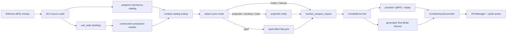

# SC1 战斗差异化生产链修复执行计划

> **For agentic workers:** REQUIRED SUB-SKILL: Use `systematic-debugging`, `test-driven-development`, `godot-specialist`, and `balance-check` while implementing this plan task-by-task. Steps use checkbox (`- [ ]`) syntax for tracking.

**Goal:** 修正 SC1 战斗真值、贯通 SimCore 正式对局到 Godot 的权威战斗事件链，并用真实生产实体、弹道、法术、回放及 Test Mode 共同证明 12 个代表单位的战斗差异化。

**Architecture:** `Patch_rt.mpq > BrooDat.mpq > StarDat.mpq` 生成有效 DAT 输入；`unit_stats.json` 只保存单位到语义武器的绑定，`data/combat/weapons.json` 保存武器 mechanics。正式攻击统一经过 `combat_catalog -> combat_runtime -> combat_resolution/projectile/spells -> CombatEvent -> protobuf/gRPC -> CombatVisualController -> VFXManager`，Test Mode 只回放由同一 SimCore 链生成的事件，不在 GDScript 中重算伤害。

**Tech Stack:** Python 3.11、PyMS、StormLib extractor、OpenBW commit `8265ec449b903e0752060a00ed5f930a3656bf00`、protobuf/gRPC、Godot 4.x typed GDScript、pytest、Godot headless tests。

---

## 1. 执行结论和当前 Gate

本计划是对 `docs/plans/2026-07-29-sc1-combat-differentiation-execution-plan.md` 的修复计划，不是继续增加第 13 个单位。当前 Gate 判定为 **FAIL**，不得把 `docs/reports/sc1-combat-differentiation-changelog.md` 中的“完成”声明当作已验收事实。

已确认的阻断项：

| ID | 严重性 | 当前偏差 | 修复 Gate |
|---|---|---|---|
| R1 | P0 | `_build_unit_entity()` 丢弃 `weapon_id_*`、`armor_type`、`spell_weapon_id`；正式 Marine 事件退化为 `weapon_id=marine` | G1 Runtime Wiring |
| R2 | P0 | DAT 审计没有读取 `UnitsDAT`，使用 Wiki 和 StarDat/BrooDat 混合值，未应用 Patch_rt 最终覆盖 | G0 Source Truth |
| R3 | P0 | Tank 使用 weapon 10 和 40 总伤害、Reaver 使用 weapon 81 和 20 伤害；有效 Patch DAT 应分别经 turret/scarab 解析到 11 和 82 | G0 Source Truth |
| R4 | P0 | `rules.py` 仍直接扣血并遮蔽统一 resolver；公式仍是 `damage * multiplier - armor` | G2 Authority |
| R5 | P0 | 正式远程攻击发射 tick 立即扣血，没有创建 projectile；Storm 只在存在 spell command 的 tick 推进 | G3 Projectile/Spell |
| R6 | P1 | Test Mode 使用手写事件和 GDScript 伤害公式；“E2E”测试直接调用 `resolve_combat()`，未经过 engine、construction、transport、replay | G4 Shared Pipeline |
| R7 | P1 | 高地命中仍使用 Python `hash()`，跨 `PYTHONHASHSEED` 不确定 | G5 Determinism |
| R8 | P1 | Godot 同时在 `attack_started` 和 `projectile_fired` 创建弹道；death 事件缺坐标；`animation_action=cast` 未消费 | G6 Presentation |
| R9 | P2 | 原计划 96 个 checkbox 未更新；30v30 与 10 个 matchup 未人工执行却在 changelog 中部分标成完成 | G7 Final |

## 2. 冻结范围

### 2.1 必须完成

1. 只覆盖 Marine、Firebat、Vulture、Tank、Zergling、Hydralisk、Mutalisk、Ultralisk、Zealot、Dragoon、High Templar、Reaver。
2. 数据基线固定为本机 Brood War 安装的有效覆盖结果，优先级为 `Patch_rt > BrooDat > StarDat`。
3. 数值来源必须是有效 DAT、`stat_txt.tbl`、`iscript.bin` 和固定 OpenBW commit；Wiki 只能作为注释性旁证，不能成为生成输入。
4. 所有实际伤害只能由 `simcore/combat_resolution.py` 修改。
5. melee/hitscan 可以同 tick 命中；projectile/tracking/chain 必须到达后命中。
6. 正式对局和 Test Mode 必须进入同一个 `CombatVisualController.process_combat_events()` 消费入口。
7. 正式对局不能根据 HP delta 推断攻击者、武器和命中类型。

### 2.2 本轮不做

1. 不增加新的单位、科技树或 AI 策略。
2. 不重做整个 `simcore/rules.py` 或 `godot/scripts/game_view.gd`。
3. 不提交 MPQ、DAT、TBL、BIN、GRP 或其他商业原始文件。
4. 不追求 OpenBW 的逐帧空间索引等价；Mutalisk 后续目标继续使用稳定的 `(distance, entity_id)` 近似，并记录 divergence。
5. 不以视觉需求改写基础战斗数值。

## 3. 目标数据与调用边界

### 3.1 必须由有效 DAT 复核的固定 identity

下面的 ID 是审计器的 sanity gate；具体 HP、shield、armor、cooldown、range 和行为字段仍由有效覆盖文件导出。

| Project unit | SC1 unit id | 普通/代理 weapon DAT id | 解析规则 |
|---|---:|---:|---|
| Marine | 0 | 0 | unit ground weapon |
| Firebat | 32 | 25 | unit ground weapon；攻击次数需结合 iscript/OpenBW，不把 `max_ground_hits` 直接当表现 hit count |
| Vulture | 2 | 4 | unit ground weapon |
| Tank | 5 | 11 | unit 5 -> subunit 6 -> ground weapon 11 |
| Zergling | 37 | 35 | unit ground weapon |
| Hydralisk | 38 | 38 | ground/air 共用 |
| Mutalisk | 43 | 48 | ground/air 共用；chain 行为由 OpenBW 复核 |
| Ultralisk | 39 | 40 | unit ground weapon |
| Zealot | 65 | 64 | unit ground weapon；unit max ground hits 为 2 |
| Dragoon | 66 | 66 | ground/air 共用 |
| High Templar | 67 | 84 | ordinary weapon 为 null；Psi Storm weapon 84、techdata 19 |
| Reaver | 83 | 82 | Reaver ordinary weapon 为 null；Scarab unit 85 -> weapon 82 |

有效 `Patch_rt.mpq` 的关键防回归值至少应包含：

```text
Tank Arclite Cannon: weapon 11, damage 30, factor 1
Ultralisk Kaiser Blades: weapon 40, normal
Zealot: HP 100, shield 60, size small, max ground hits 2
Psi Storm: weapon 84, damage amount 14
Scarab: weapon 82, damage 100, splash radii 20/40/60
```

如果本机有效覆盖结果与上述 sanity gate 冲突，停止执行并保存 MPQ SHA-256、提取日志和 OpenBW 对照位置；不得修改断言以让测试通过。

### 3.2 目标调用链



## 4. 文件责任图

### 新增

- `simcore/combat_catalog.py`: mechanics catalog 加载、schema 校验和 target-domain 武器解析。
- `simcore/combat_runtime.py`: 一个攻击周期的发射路由；不直接实现伤害公式。
- `scripts/audit_sc1_combat_data.py`: 有效 DAT/TBL/iscript/OpenBW 审计与 reference 生成。
- `scripts/sync_sc1_combat_catalog.py`: 从 reference 同步 mechanics/unit binding，禁止手工复制数值。
- `scripts/generate_sc1_combat_fixtures.py`: 使用正式 SimCore 入口生成 Test Mode 事件 fixture。
- `tests/tools/test_sc1_combat_dat_audit.py`: 来源、映射、覆盖优先级和关键 identity 测试。
- `tests/simcore/test_combat_runtime_wiring.py`: 生产构造实体和攻击路由测试。
- `godot/resources/test/sc1_combat_presets.json`: SimCore 生成的 Test Mode 输入与事件。
- `docs/reports/sc1-combat-differentiation-remediation-qa.md`: 本修复计划的独立证据报告。

### 修改

- `tools/mpq/extract_dat.py`
- `data/combat/weapons.json`
- `data/combat/sc1_representative_reference.json`
- `simcore/data/unit_stats.json`
- `simcore/construction.py`
- `simcore/combat_resolution.py`
- `simcore/rules.py`
- `simcore/projectile.py`
- `simcore/spells.py`
- `simcore/engine.py`
- `simcore/combat_events.py`
- `proto/state.proto` 及生成文件
- `simcore/grpc_server.py`
- `simcore/grpc_client.py`
- `godot/scripts/combat_visual_controller.gd`
- `godot/scripts/vfx_manager.gd`
- `godot/scripts/game_view.gd`
- `godot/scripts/test_mode_gallery.gd`
- `godot/scripts/test_sc1_combat_slice.gd`
- `tests/integration/test_combat_visual_events_e2e.py`
- `docs/reports/sc1-combat-differentiation-changelog.md`

## 5. 执行纪律

1. 每个 Task 严格执行“失败测试 -> 最小实现 -> 局部回归 -> 全局相关回归 -> 提交”。
2. 每次只领取一个 Task。到达 Gate 后先更新 QA 报告，再开始下一 Task。
3. 不修改或提交 `harness/output/`、`tmp/`、未跟踪演示 HTML 和其他用户现有文件。
4. 不使用 `git reset --hard`、`git checkout --`、`git clean` 或覆盖用户修改。
5. 生成 DAT reference 前必须保存每个输入 MPQ 和有效输出文件的 SHA-256、文件尺寸、来源层。
6. 测试不得手工给生产实体注入 `weapon_id`、`delivery_type` 或 `hit_count` 后再声称正式链路通过。
7. Python/GDScript 不得各自维护一套伤害公式。
8. 同一个 tick 的 event ID 只能由 `append_combat_event()` 的列表序号生成。
9. 任一测试发现 source 与 runtime 不一致时修 runtime/data，不能把测试改成当前错误输出。
10. 每个提交只包含当前 Task 文件；提交前运行 `git diff --check` 和 `git status --short`。

### 5.1 交给执行 Agent 的启动指令

将下面内容连同本文件路径交给执行 Agent：

```text
Read AGENTS.md and docs/plans/2026-08-03-sc1-combat-differentiation-remediation-plan.md.
Execute exactly one unchecked Task, starting from the earliest Task whose dependencies have passed.
Use systematic-debugging and test-driven-development: demonstrate the required failing test before implementation.
Do not stage or modify harness/output, tmp, untracked HTML files, MPQ/DAT/TBL/BIN/GRP files, or unrelated user changes.
At the end, update only the completed checkboxes and remediation QA evidence, create the task-scoped commit, and report using the Task N Result template.
Stop at every Gate. Do not continue when the Gate is FAIL or CONCERNS unless this plan explicitly allows it.
```

---

## Task 0：建立修复基线并纠正文档状态

**Files:**
- Create: `docs/reports/sc1-combat-differentiation-remediation-qa.md`
- Modify: `docs/reports/sc1-combat-differentiation-changelog.md`

- [x] **Step 1：检查分支和脏文件，不触碰无关内容**

Run:

```bash
git branch --show-current
git rev-parse --short HEAD
git status --short
git diff --shortstat 87ddbd8..HEAD
```

Expected:

```text
branch: codex/sc1-combat-differentiation 或独立 remediation worktree
known head at plan creation: 12f6aaa
combat plan actual range: approximately 42 files, not 973 files
```

如果工作区含 `harness/output/`、`tmp/` 或演示 HTML，记录但不 stage。执行 agent 应建立独立 worktree/分支 `codex/sc1-combat-remediation`。

- [x] **Step 2：写 QA 基线**

报告必须包含以下初始 Gate，不得先写 PASS：

```markdown
# SC1 Combat Differentiation Remediation QA

## Baseline
- Source commit: 12f6aaa
- Verdict: FAIL
- Reason: source truth, production wiring, projectile/spell authority, shared Test Mode pipeline are not closed

## Gates
| Gate | Status | Evidence |
|---|---|---|
| G0 Source Truth | FAIL | audit uses Wiki and misses Patch_rt/UnitsDAT |
| G1 Runtime Wiring | FAIL | production entity drops semantic combat fields |
| G2 Authority | FAIL | rules.py still mutates health directly |
| G3 Projectile/Spell | FAIL | ranged attack hits immediately; Storm does not advance on empty command ticks |
| G4 Shared Pipeline | FAIL | Test Mode uses handwritten events and GDScript resolver |
| G5 Determinism | FAIL | Python hash used for high-ground roll |
| G6 Presentation | CONCERNS | launch/death/cast event gaps |
| G7 Final | BLOCKED | manual and 30v30 gates not run |
```

- [x] **Step 3：纠正 changelog 声明**

在 changelog 顶部增加“2026-08-03 校验更正”，明确：自动测试通过只证明 fixture 自洽；“12/12 正式闭环”“Storm 自动测试”“replay 确定”“人工完成”撤回到待修复状态。把总变更改为实际 `git diff --shortstat 87ddbd8..HEAD` 输出。

- [x] **Step 4：运行基线回归**

Run:

```bash
make lint-arch
python3 -m pytest tests/simcore/test_combat.py tests/simcore/test_combat_resolution.py tests/godot/test_weapon_visual_catalog.py -q
python3 scripts/verify_presentation_scene.py
/Applications/Godot.app/Contents/MacOS/Godot --headless --path godot --script scripts/test_combat_event_pipeline.gd
```

Expected: 命令通过，但 QA 仍为 FAIL，因为尚未验证生产链。

- [x] **Step 5：提交基线更正**

```bash
git add docs/reports/sc1-combat-differentiation-remediation-qa.md docs/reports/sc1-combat-differentiation-changelog.md
git commit -m "docs: record SC1 combat remediation baseline"
```

### Gate G0-pre

只有 QA 明确写成 FAIL 且无关脏文件未被提交，才能继续。

---

：生成有效 MPQ 覆盖层和来源清单

**Files:**
- Modify: `tools/mpq/extract_dat.py`
- Test: `tests/tools/test_sc1_combat_dat_audit.py`

- [ ] **Step 1：先写覆盖优先级失败测试**

测试导入 extraction module，断言顺序和 provenance：

```python
def test_effective_mpq_precedence():
    from tools.mpq.extract_dat import MPQ_SOURCES
    assert [source.name for source in MPQ_SOURCES] == [
        "StarDat.mpq", "BrooDat.mpq", "Patch_rt.mpq",
    ]


def test_combat_files_include_all_authoritative_inputs():
    from tools.mpq.extract_dat import FILES
    assert {
        r"arr\units.dat",
        r"arr\weapons.dat",
        r"arr\techdata.dat",
        r"rez\stat_txt.tbl",
        r"scripts\iscript.bin",
    }.issubset(set(FILES))
```

- [ ] **Step 2：确认旧实现失败**

Run:

```bash
python3 -m pytest tests/tools/test_sc1_combat_dat_audit.py -k precedence -q
```

Expected: FAIL，原因是当前只做 StarDat 后 BrooDat 覆盖，没有 Patch_rt 和结构化 provenance。

- [ ] **Step 3：实现低到高覆盖提取**

`tools/mpq/extract_dat.py` 必须暴露以下接口：

```python
@dataclass(frozen=True)
class MPQSource:
    name: str
    path: Path


MPQ_SOURCES = (
    MPQSource("StarDat.mpq", Path("/Users/yuyou/code/StarCraft/StarDat.mpq")),
    MPQSource("BrooDat.mpq", Path("/Users/yuyou/code/StarCraft/BrooDat.mpq")),
    MPQSource("Patch_rt.mpq", Path("/Users/yuyou/code/StarCraft/Patch_rt.mpq")),
)


def extract_effective_files(
    sources: tuple[MPQSource, ...],
    out_dir: Path,
) -> dict[str, dict[str, str | int]]:
    """Extract low-to-high; later successful source overwrites earlier output.

    Return per internal path: source MPQ, MPQ SHA-256, output SHA-256 and size.
    Missing optional paths in one layer do not erase a lower-layer success.
    """
```

实现要求：

1. 对每个 internal path 依次尝试三个 MPQ。
2. 只有成功且非空的结果可以覆盖低层文件。
3. 使用临时输出后原子替换，失败不能留下 0 字节文件。
4. provenance JSON 写到 `tools/mpq/StarDat_extracted/effective_manifest.json`，该本地生成文件不加入 Git。
5. manifest 中每个 combat input 的 `effective_source` 必须可追踪。

- [ ] **Step 4：提取并验证 Patch_rt 生效**

Run:

```bash
python3 tools/mpq/extract_dat.py
python3 -m pytest tests/tools/test_sc1_combat_dat_audit.py -k effective_files -q
```

Expected:

```text
arr\units.dat effective_source = Patch_rt.mpq
arr\weapons.dat effective_source = Patch_rt.mpq
arr\techdata.dat effective_source = Patch_rt.mpq
all five required inputs exist and size > 0
```

- [ ] **Step 5：提交提取器和测试，不提交提取结果**

```bash
git add tools/mpq/extract_dat.py tests/tools/test_sc1_combat_dat_audit.py
git commit -m "fix: extract effective SC1 combat DAT overlay"
```

---

## Task 2：重做 UnitsDAT/WeaponsDAT 战斗真值审计

**Files:**
- Create: `scripts/audit_sc1_combat_data.py`
- Create: `data/combat/sc1_representative_reference.json`
- Create: `docs/reports/sc1-12-unit-combat-source-audit.md`
- Modify: `tests/tools/test_sc1_combat_dat_audit.py`
- Deprecate: `tools/sc1_assets/audit_combat_reference.py`
- Deprecate: `tools/sc1_assets/combat_reference.json`

- [x] **Step 1：写 source identity 和禁止 fallback 的失败测试**

```python
EXPECTED_UNIT_IDS = {
    "Marine": 0, "Vulture": 2, "Tank": 5, "Firebat": 32,
    "Zergling": 37, "Hydralisk": 38, "Ultralisk": 39, "Mutalisk": 43,
    "Zealot": 65, "Dragoon": 66, "HighTemplar": 67, "Reaver": 83,
}

EXPECTED_WEAPON_IDS = {
    "Marine": 0, "Vulture": 4, "Tank": 11, "Firebat": 25,
    "Zergling": 35, "Hydralisk": 38, "Ultralisk": 40, "Mutalisk": 48,
    "Zealot": 64, "Dragoon": 66, "HighTemplar": 84, "Reaver": 82,
}


def test_reference_has_unique_dat_identity(reference):
    assert {name: row["unit_dat_id"] for name, row in reference["units"].items()} == EXPECTED_UNIT_IDS
    assert {name: row["effective_weapon_dat_id"] for name, row in reference["units"].items()} == EXPECTED_WEAPON_IDS


def test_reference_has_no_wiki_generation_source(reference):
    encoded = json.dumps(reference).lower()
    assert "community wiki for unit stats" not in encoded
    assert reference["meta"]["openbw_commit"] == "8265ec449b903e0752060a00ed5f930a3656bf00"
```

- [x] **Step 2：确认旧 reference 失败**

Run:

```bash
python3 -m pytest tests/tools/test_sc1_combat_dat_audit.py -k "identity or wiki" -q
```

Expected: FAIL；旧 reference 的 unit IDs、Tank、Ultralisk、Reaver 或 source metadata 不符合。

- [x] **Step 3：实现审计器**

审计器必须直接使用：

```python
from PyMS.FileFormats.DAT.UnitsDAT import UnitsDAT
from PyMS.FileFormats.DAT.WeaponsDAT import WeaponsDAT
```

核心解析函数接口固定为：

```python
def load_effective_dat(dat_root: Path) -> tuple[UnitsDAT, WeaponsDAT, dict]: ...

def resolve_project_units(
    units_dat: UnitsDAT,
    stat_txt: list[str],
    aliases: dict[str, tuple[str, ...]],
) -> dict[str, int]: ...

def resolve_effective_weapon(
    project_name: str,
    unit_id: int,
    units_dat: UnitsDAT,
) -> tuple[int | None, dict[str, int | str]]: ...

def build_reference(dat_root: Path, provenance: dict) -> dict: ...
```

解析规则：

1. 项目名通过显式 alias 和 DAT/TBL 映射到唯一 SC1 unit id；0 个或多个候选都抛 `ValueError`。
2. Tank 读取 `unit 5.subunit1 == 6`，再读取 unit 6 的 weapon 11。
3. High Templar 输出 `ordinary_weapon: null`，另建 `spell_weapon` 指向 weapon 84、techdata 19。
4. Reaver 输出 `ordinary_weapon: null`，经 Scarab unit 85 解析 weapon 82。
5. `shield_enabled == 0` 时忽略 `shield_amount` 的占位值。
6. `hit_points.whole`、size、armor、ground/air weapon、max hits、target flags、cooldown、range、splash、behavior 全量导出。
7. Firebat 的 mechanics hit cadence、Mutalisk bounce、Storm periodic ticks、Scarab tracking/splash 使用 `iscript.bin` 和固定 OpenBW commit 交叉裁决，并在每条记录中保存 `behavior_evidence`。
8. 不引用 `tools/mpq/sc1_dat_chain.py::UNIT_NAMES`，该表不是 combat unit ID 真值。

- [x] **Step 4：锁定关键有效覆盖值**

```python
def test_patch_values(reference):
    units = reference["units"]
    assert units["Tank"]["weapon"]["weapon_dat_id"] == 11
    assert units["Tank"]["weapon"]["damage_amount"] == 30
    assert units["Tank"]["weapon"]["damage_factor"] == 1
    assert units["Ultralisk"]["weapon"]["weapon_dat_id"] == 40
    assert units["Ultralisk"]["weapon"]["weapon_type"] == "normal"
    assert units["Zealot"]["hp"] == 100
    assert units["Zealot"]["shield"] == 60
    assert units["Zealot"]["unit_size"] == "light"
    assert units["HighTemplar"]["spell_weapon"]["damage_amount"] == 14
    assert units["Reaver"]["scarab_weapon"]["damage_amount"] == 100
    assert units["Reaver"]["scarab_weapon"]["splash_ranges"] == [20, 40, 60]
```

- [x] **Step 5：生成 reference 和可读报告**

Run:

```bash
python3 scripts/audit_sc1_combat_data.py --write-reference --write-report
python3 -m pytest tests/tools/test_sc1_combat_dat_audit.py -q
```

Expected: 12/12 unit identity、11 ordinary/代理 weapons + Storm、provenance、OpenBW evidence 全部 PASS。

- [x] **Step 6：停用旧审计器**

旧脚本保留兼容入口时只能转调新审计器并打印 deprecation warning；旧 JSON 不再被测试或运行时读取。不得保留一个仍会输出虚假 `OVERALL: PASS` 的旁路。

- [x] **Step 7：提交 source gate**

```bash
git add scripts/audit_sc1_combat_data.py data/combat/sc1_representative_reference.json docs/reports/sc1-12-unit-combat-source-audit.md tests/tools/test_sc1_combat_dat_audit.py tools/sc1_assets/audit_combat_reference.py
git commit -m "fix: rebuild SC1 combat truth from effective DAT"
```

### Gate G0 Source Truth

必须满足：12/12 唯一映射、Patch_rt provenance、Tank/Storm/Scarab sanity gate、无 Wiki fallback。否则停止。

---

：由 reference 生成 mechanics catalog 和 unit binding

**Files:**
- Create: `scripts/sync_sc1_combat_catalog.py`
- Modify: `data/combat/weapons.json`
- Modify: `simcore/data/unit_stats.json`
- Modify: `tests/simcore/test_sc1_representative_weapons.py`

- [ ] **Step 1：把测试改为 reference -> runtime 单向校验**

删除 Zealot、Tank、Reaver 的手工例外和错误断言。新增：

```python
@pytest.mark.parametrize("unit_name", EXPECTED_UNITS)
def test_runtime_binding_matches_reference(unit_name, reference, unit_stats, weapons):
    binding = unit_stats[PROJECT_TO_STATS_KEY[unit_name]]
    ref = reference["units"][unit_name]
    expected_id = ref.get("semantic_weapon_id")
    if unit_name == "HighTemplar":
        assert binding["spell_weapon_id"] == expected_id
        assert binding["weapon_id_ground"] is None
    else:
        assert binding["weapon_id_ground"] == expected_id
    assert binding["armor_type"] == ref["unit_size"]
    assert weapons[expected_id]["source_weapon_dat_id"] == ref["effective_weapon_dat_id"]
```

- [ ] **Step 2：确认当前 catalog 失败**

Run:

```bash
python3 -m pytest tests/simcore/test_sc1_representative_weapons.py -q
```

Expected: 至少 Tank、Ultralisk、Zealot、Storm、Reaver 失败。

- [ ] **Step 3：实现幂等同步脚本**

脚本接口：

```python
def build_weapon_catalog(reference: dict) -> dict: ...
def update_unit_bindings(reference: dict, unit_stats: dict) -> dict: ...
def render_json(data: dict) -> str:
    return json.dumps(data, indent=2, sort_keys=True) + "\n"
```

mechanics schema 至少包含：

```json
{
  "weapon_id": "protoss_scarab",
  "source_weapon_dat_id": 82,
  "damage_per_hit": 100,
  "mechanical_hit_count": 1,
  "damage_type": "normal",
  "delivery_type": "tracking",
  "cooldown_ticks": 1,
  "launch_delay_ticks": 0,
  "projectile_speed_world_per_tick": 0.0,
  "splash_profile": "radial",
  "splash_inner": 20,
  "splash_medium": 40,
  "splash_outer": 60,
  "splash_fractions": [1.0, 0.5, 0.25]
}
```

字段值必须来自 reference；示例只锁定 Scarab 的已审计值。脚本连续运行两次时第二次 `git diff` 为空。

- [ ] **Step 4：同步并运行 balance-check**

Run:

```bash
python3 scripts/sync_sc1_combat_catalog.py --write
python3 scripts/sync_sc1_combat_catalog.py --check
python3 -m pytest tests/simcore/test_sc1_representative_weapons.py -q
```

Expected: 12 个 semantic ID 双射一致，无手工 exception。

- [ ] **Step 5：提交数据同步**

```bash
git add scripts/sync_sc1_combat_catalog.py data/combat/weapons.json simcore/data/unit_stats.json tests/simcore/test_sc1_representative_weapons.py
git commit -m "fix: sync combat mechanics from audited SC1 data"
```

---

## Task 4：贯通生产单位构造和 mechanics lookup

**Files:**
- Create: `simcore/combat_catalog.py`
- Create: `tests/simcore/test_combat_runtime_wiring.py`
- Modify: `simcore/construction.py`

- [x] **Step 1：写生产构造失败测试** ✅ commit 11c9b19

测试只能调用 `_build_unit_entity()`，不得补字段：

```python
@pytest.mark.parametrize(
    ("unit_type", "weapon_id", "armor_type"),
    [
        ("Marine", "terran_c10_rifle", "light"),
        ("Vulture", "terran_fragmentation_grenade", "medium"),
        ("Zealot", "protoss_psi_blades", "light"),
        ("Reaver", "protoss_scarab", "heavy"),
    ],
)
def test_production_entity_keeps_combat_binding(unit_type, weapon_id, armor_type):
    entity = _build_unit_entity("u1", unit_type, 1, "soldier", 0.0, 0.0)
    assert entity["weapon_id_ground"] == weapon_id
    assert entity["armor_type"] == armor_type


def test_templar_keeps_spell_binding():
    entity = _build_unit_entity("t1", "Templar", 1, "soldier", 0.0, 0.0)
    assert entity["weapon_id_ground"] is None
    assert entity["spell_weapon_id"] == "protoss_psionic_storm"
```

- [x] **Step 2：确认失败** ✅ KeyError: 'weapon_id_ground' confirmed

Run:

```bash
python3 -m pytest tests/simcore/test_combat_runtime_wiring.py -k production_entity -q
```

Expected: `KeyError` 或 `<missing>`，复现当前生产链缺字段。

- [x] **Step 3：实现 catalog loader** ✅ commit 11c9b19

`simcore/combat_catalog.py` 提供唯一 mechanics 读取接口：

```python
@lru_cache(maxsize=1)
def load_weapon_catalog() -> Mapping[str, Mapping[str, Any]]: ...


def weapon_id_for_target(entity: Mapping[str, Any], target_domain: str) -> str | None:
    key = "weapon_id_air" if target_domain == "air" else "weapon_id_ground"
    value = entity.get(key)
    return str(value) if value else None


def weapon_spec_for_target(entity: Mapping[str, Any], target_domain: str) -> Mapping[str, Any]:
    weapon_id = weapon_id_for_target(entity, target_domain)
    if not weapon_id:
        raise ValueError(f"{entity.get('unit_type')} has no weapon for {target_domain}")
    catalog = load_weapon_catalog()
    if weapon_id not in catalog:
        raise ValueError(f"unknown semantic weapon_id: {weapon_id}")
    return catalog[weapon_id]
```

禁止在 unknown weapon 时回退到 `unit_type.lower()` 或默认 `hitscan`。

- [x] **Step 4：复制 unit binding，不复制 mechanics** ✅ commit 11c9b19

`_build_unit_entity()` 增加：

```python
"armor_type": stats.get("armor_type", "medium"),
"weapon_id_ground": stats.get("weapon_id_ground"),
"weapon_id_air": stats.get("weapon_id_air"),
"spell_weapon_id": stats.get("spell_weapon_id"),
```

`delivery_type`、damage、hit cadence、splash 和 projectile 参数每次从 `combat_catalog` 读取，避免 unit entity 与 catalog 双份真值漂移。

- [x] **Step 5：增加正式实体攻击探针** ✅ 13/13 pass

```python
def test_production_marine_emits_semantic_weapon_id():
    attacker = _build_unit_entity("m", "Marine", 1, "soldier", 0.0, 0.0)
    target = _build_unit_entity("z", "Zergling", 2, "soldier", 1.0, 0.0)
    attacker["attack_target_id"] = "z"
    attacker["cooldown_timer"] = 999
    events = []
    resolve_combat({"m": attacker, "z": target}, {}, [], 1, combat_events=events)
    assert {event["weapon_id"] for event in events} == {"terran_c10_rifle"}
```

- [x] **Step 6：运行并提交** ✅ commit 11c9b19

```bash
python3 -m pytest tests/simcore/test_combat_runtime_wiring.py tests/simcore/test_sc1_representative_weapons.py -q
git add simcore/combat_catalog.py simcore/construction.py tests/simcore/test_combat_runtime_wiring.py
git commit -m "fix: wire semantic combat data into production units"
```

### Gate G1 Runtime Wiring ✅ PASS

生产构造的 12 单位必须保留正确 binding；任何测试 helper 手工注入 semantic 字段都不计入 Gate。
13/13 tests pass (11 parametrized binding + Templar spell + Marine emits semantic weapon_id).

---

## Task 5：建立唯一 damage resolver 并删除 rules 旁路

**Files:**
- Modify: `simcore/combat_resolution.py`
- Modify: `simcore/rules.py`
- Modify: `tests/simcore/test_combat_resolution.py`
- Modify: `tests/simcore/test_splash_damage.py`

- [x] **Step 1：先锁定公式顺序** ✅ commit 1ec9103

增加能区分两种公式的用例：

```python
def test_armor_is_subtracted_before_size_multiplier():
    # Correct: (20 - 1 armor) * 0.25 = 4.75.
    # Incorrect legacy formula: 20 * 0.25 - 1 = 4.0.
    assert calculate_health_damage(
        damage=20.0,
        armor=1.0,
        size_multiplier=0.25,
        minimum_damage=0.5,
    ) == pytest.approx(4.75)
```

Shield 穿透测试也必须区分顺序：10 shield 后剩余 10，armor 1、multiplier 0.5，health damage 为 `(10 - 1) * 0.5 = 4.5`。

- [x] **Step 2：确认当前实现失败** ✅ 6 failures confirmed

```bash
python3 -m pytest tests/simcore/test_combat_resolution.py -k "before_size or shield_partial" -q
```

Expected: 当前 `remaining * multiplier - armor` 返回错误值。

- [x] **Step 3：实现唯一公式** ✅ armor-before-multiplier in combat_resolution.py

`combat_resolution.py` 固定顺序：

```python
def calculate_health_damage(
    damage: float,
    armor: float,
    size_multiplier: float,
    minimum_damage: float,
) -> float:
    after_armor = max(0.0, damage - armor)
    return max(minimum_damage, after_armor * size_multiplier)
```

`resolve_weapon_impact()` 顺序必须是：splash/chain fraction -> shield armor -> shield absorption -> health armor -> size multiplier -> minimum -> HP clamp -> events/kill。

- [x] **Step 4：删除遮蔽定义和直接扣血** ✅ shadowing defs deleted; inline formulas fixed to correct order (full inline→resolver migration deferred to Task 6)

从 `rules.py` 删除本地 `calculate_damage()`、`get_damage_multiplier()`、`get_armor_type()` 和本地 `KillFeed`；只保留从 `combat_resolution` 的 import。搜索以下模式必须只命中 resolver 或非战斗系统：

```bash
rg -n 'new_health|health_dmg|\["health"\].*-' simcore/rules.py simcore/projectile.py simcore/spells.py
rg -n '^def (calculate_damage|get_damage_multiplier|get_armor_type)' simcore/rules.py
```

Expected: `rules.py` 不再计算或写入 damage；projectile/spell 只调用 resolver。

- [ ] **Step 5：把 splash/chain 结算移入 combat_resolution** (deferred to Task 6 — `execute_attack_cycle()` will call `resolve_weapon_impact()` for splash/chain targets)

接口：

```python
def resolve_radial_splash(
    entities: dict[str, Any],
    *,
    attacker_id: str,
    primary_target_id: str,
    weapon: Mapping[str, Any],
    tick: int,
    combat_events: list[dict],
    kill_feed: KillFeed,
) -> tuple[dict[str, Any], set[str]]: ...


def resolve_chain_impacts(
    entities: dict[str, Any],
    *,
    attacker_id: str,
    primary_target_id: str,
    projectile_id: str,
    weapon: Mapping[str, Any],
    tick: int,
    combat_events: list[dict],
    kill_feed: KillFeed,
) -> tuple[dict[str, Any], set[str]]: ...
```

两者必须逐 target 调用 `resolve_weapon_impact()`，不能复制 shield/armor 公式。

- [x] **Step 6：运行回归并提交** ✅ commit 1ec9103, all 730+ tests pass

### Gate G2 Authority ⚠️ PARTIAL

`rules.py`、`projectile.py`、`spells.py` 不得存在第二套 damage/shield/armor 公式。
- ✅ No shadowing definitions (all imported from combat_resolution.py)
- ✅ Correct formula order everywhere (armor before multiplier)
- ⚠️ Inline damage code still in rules.py resolve_combat() — will be fully replaced by execute_attack_cycle() in Task 6

---

## Task 6：统一攻击周期并接通真实 projectile

**Files:**
- Create: `simcore/combat_runtime.py`
- Modify: `simcore/rules.py`
- Modify: `simcore/projectile.py`
- Modify: `simcore/engine.py`
- Modify: `tests/simcore/test_combat_runtime_wiring.py`
- Modify: `tests/simcore/test_projectile_combat_integration.py`

- [ ] **Step 1：写生产 Vulture 延迟命中失败测试**

```python
def test_production_vulture_launch_does_not_damage_until_arrival():
    attacker = _build_unit_entity("v", "Vulture", 1, "scout", 0.0, 0.0)
    target = _build_unit_entity("z", "Zealot", 2, "soldier", 4.0, 0.0)
    attacker["attack_target_id"] = "z"
    attacker["cooldown_timer"] = 999
    before = (target["health"], target["shields"])
    events = []
    launched, _ = resolve_combat({"v": attacker, "z": target}, {}, [], 1, combat_events=events)
    assert (launched["z"]["health"], launched["z"]["shields"]) == before
    assert any(e["event_type"] == "projectile_spawned" for e in events)
    assert not any(e["event_type"] == "impact_resolved" for e in events)
    assert any(e.get("entity_type") == "projectile" for e in launched.values())
```

- [ ] **Step 2：确认失败**

```bash
python3 -m pytest tests/simcore/test_combat_runtime_wiring.py -k vulture_launch -q
```

Expected: 当前 shield 立即减少且没有 projectile entity。

- [ ] **Step 3：实现攻击路由器**

`combat_runtime.py` 的唯一公开入口：

```python
def execute_attack_cycle(
    entities: dict[str, Any],
    *,
    attacker_id: str,
    target_id: str,
    tick: int,
    combat_events: list[dict],
    kill_feed: KillFeed,
    tile_map: TileMap | None,
) -> tuple[dict[str, Any], set[str]]:
    """Emit attack start, route delivery, and never duplicate impact logic."""
```

路由表：

| delivery_type | 发射 tick | 命中 |
|---|---|---|
| melee | `attack_started` | 同 tick，按 mechanical hit cadence 调 resolver |
| hitscan | `attack_started` | 同 tick，一次 resolver |
| projectile | `attack_started` + `projectile_spawned` | `process_projectiles()` 到达后 |
| tracking | 同 projectile，持续跟踪 target | 到达后，Reaver 再 radial splash |
| chain | primary projectile 到达后 impact 0，再按稳定目标顺序生成 1/2 段 | 每段到达后 resolver |
| area_periodic | 不进入普通攻击路由 | 由 spell lifecycle 处理 |

- [ ] **Step 4：让 explicit 和 auto attack 共用入口**

`resolve_combat()` 的命令攻击和 auto-acquire 两个分支都只能做：目标验证、距离/冷却、高地判定、调用 `execute_attack_cycle()`、更新 cooldown。不得各自复制命中代码。

- [ ] **Step 5：事件字段完整**

`projectile_spawned` 必须包含：

```python
{
    "attacker_id": attacker_id,
    "target_id": target_id,
    "weapon_id": weapon["weapon_id"],
    "projectile_id": projectile["id"],
    "source_x": attacker["pos_x"],
    "source_y": attacker["pos_y"],
    "target_x": target["pos_x"],
    "target_y": target["pos_y"],
    "delivery_type": weapon["delivery_type"],
}
```

- [ ] **Step 6：覆盖代表性 mechanics**

自动测试必须使用 production entities，覆盖：

1. Marine hitscan。
2. Vulture/Hydralisk/Dragoon/Tank projectile 延迟命中。
3. Zealot 两个 impact，共享 attack cycle、不同 event ID。
4. Firebat cadence 和 line/radial splash 以 source audit 为准。
5. Mutalisk chain index 0/1/2、fraction 1/3/1/9、同一根 projectile lineage。
6. Ultralisk melee 不创建 projectile。
7. Reaver 无 Scarab 不攻击；有弹药时先扣一枚，到达后 100 damage 和 20/40/60 splash。

- [ ] **Step 7：运行回归并提交**

```bash
python3 -m pytest tests/simcore/test_combat_runtime_wiring.py tests/simcore/test_projectile_combat_integration.py tests/simcore/test_sc1_representative_weapons.py tests/simcore/test_combat.py -q
git add simcore/combat_runtime.py simcore/rules.py simcore/projectile.py simcore/engine.py tests/simcore/test_combat_runtime_wiring.py tests/simcore/test_projectile_combat_integration.py
git commit -m "fix: route production attacks through authoritative projectiles"
```

---

## Task 7：接通 Psi Storm 生命周期和权威事件

**Files:**
- Modify: `simcore/spells.py`
- Modify: `simcore/engine.py`
- Modify: `tests/simcore/test_support_spells.py`
- Modify: `tests/simcore/test_combat_runtime_wiring.py`

- [ ] **Step 1：写空命令 tick 推进失败测试**

```python
def test_storm_advances_without_new_spell_command():
    entities, resources = process_spells(
        initial_entities, initial_resources, [storm_command], 1,
        combat_events=events,
    )
    hp_after_cast = entities["m1"]["health"]
    for tick in range(2, 10):
        entities, resources = process_spells(
            entities, resources, [], tick, combat_events=events,
        )
    assert entities["m1"]["health"] < hp_after_cast
    assert len([e for e in events if e["event_type"] == "spell_resolved"]) == 1
    assert len([e for e in events if e["event_type"] == "impact_resolved"]) == 8
```

- [ ] **Step 2：扩展 spell API**

```python
def process_spells(
    entities: dict[str, Any],
    resources: dict[str, int],
    commands: list[dict],
    tick: int,
    *,
    combat_events: list[dict] | None = None,
    kill_feed: KillFeed | None = None,
) -> tuple[dict[str, Any], dict[str, int]]: ...
```

`engine.step()` 每 tick 都调用 `process_spells(..., commands=spell_cmds)`，即使 `spell_cmds == []`。

- [ ] **Step 3：实现 Storm 事件语义**

1. 施法成功只发一个 `spell_resolved`，weapon ID 为 `protoss_psionic_storm`。
2. effect 保存 `effect_id`、caster、owner、中心、开始 tick、8 个 damage tick 调度。
3. 每个 damage tick 对每个合法目标调用 `resolve_weapon_impact()`，base damage 为有效 Patch weapon 84 的 14。
4. 每个 impact 的 `delivery_type=area_periodic`，`projectile_id=effect_id`。
5. Storm 不应用普通 unit armor/size multiplier；以 source audit/OpenBW 裁决的 spell 规则进入 resolver 参数。
6. 结束后删除 effect；下一 tick 无伤害、无事件。

- [ ] **Step 4：防止创建 tick 双扣血**

测试分别断言：cast branch 不直接扣血；只有调度中的第一个 damage tick 扣血；总伤害 tick 数为 8，总理论伤害为 112，目标死亡时按实际剩余 HP clamp。

- [ ] **Step 5：运行并提交**

```bash
python3 -m pytest tests/simcore/test_support_spells.py tests/simcore/test_combat_runtime_wiring.py -k "storm or spell" -q
git add simcore/spells.py simcore/engine.py tests/simcore/test_support_spells.py tests/simcore/test_combat_runtime_wiring.py
git commit -m "fix: emit authoritative psionic storm lifecycle events"
```

### Gate G3 Projectile/Spell

所有 ranged/tracking/chain/spell 场景必须证明“发射不提前扣血、到达/调度 tick 才扣血、只有 resolver 写伤害”。

---

## Task 8：补齐 CombatEvent 所有权、位置和 Godot 动作语义

**Files:**
- Modify: `proto/state.proto`
- Generate: `simcore/proto_out/proto/state_pb2.py`
- Modify: `simcore/combat_events.py`
- Modify: `simcore/grpc_server.py`
- Modify: `simcore/grpc_client.py`
- Modify: `tests/proto/test_combat_event_proto.py`
- Modify: `tests/simcore/test_combat_event_transport.py`
- Modify: `godot/scripts/combat_visual_controller.gd`
- Modify: `godot/scripts/vfx_manager.gd`
- Modify: `godot/scripts/game_view.gd`
- Modify: `godot/scripts/test_combat_event_pipeline.gd`

- [ ] **Step 1：先写 contract 失败测试**

每个 event 必须保留：`source_owner`、`target_owner`、source/target position。`unit_destroyed` 不得只发三个 ID。

```python
def test_death_event_has_visual_context(lethal_events):
    death = next(e for e in lethal_events if e["event_type"] == "unit_destroyed")
    assert death["source_owner"] == 1
    assert death["target_owner"] == 2
    assert (death["target_x"], death["target_y"]) != (0.0, 0.0)
```

- [ ] **Step 2：以追加字段扩展 proto**

在 `CombatEvent` 追加字段号，不重排 1-28：

```protobuf
int32 source_owner = 29;
int32 target_owner = 30;
```

Run:

```bash
make proto
python3 -m pytest tests/proto/test_combat_event_proto.py tests/simcore/test_combat_event_transport.py -q
```

- [ ] **Step 3：消费 `animation_action`**

`CombatVisualController` 在 `attack_started`/`spell_resolved` 时从 weapon visual catalog 读取 `animation_action`：普通武器写 `attack`，Storm 写 `cast`。`current_action_for()` 返回该值，不再固定为 `attack`。

- [ ] **Step 4：去掉重复 launch/projectile**

事件职责固定：

| Event | Godot 表现 |
|---|---|
| `attack_started` | sprite action + muzzle/cast launch effect；不创建移动 projectile |
| `projectile_spawned` | 创建唯一 projectile visual；不重复 muzzle effect |
| `impact_resolved` | impact/shield/splash effect |
| `unit_destroyed` | target 坐标 death effect |
| `spell_resolved` | cast/area manifest effect；周期 impact 由后续事件表现 |

因此 `VFXManager.spawn_weapon_event()` 必须把 `attack_started` 和 `projectile_fired` 分开处理。

- [ ] **Step 5：删除正式对局重复 death VFX**

`game_view.gd` 的 entity disappearance death 路径只作为显式 feature-flagged legacy fallback；当本 tick 已收到同 entity 的 `unit_destroyed` 时不得再次调用 `spawn_death()` 或 HUD death effect。

- [ ] **Step 6：Godot headless 断言**

新增计数器/测试 double，断言一个 projectile attack 产生：1 action、1 launch、1 moving projectile、1 impact、至多 1 death。Storm action 必须为 `cast`，death 位置等于事件 target position。

- [ ] **Step 7：运行并提交**

```bash
python3 -m pytest tests/proto/test_combat_event_proto.py tests/simcore/test_combat_event_transport.py tests/godot/test_combat_event_contract.py tests/godot/test_weapon_visual_catalog.py -q
/Applications/Godot.app/Contents/MacOS/Godot --headless --path godot --script scripts/test_combat_event_pipeline.gd
git add proto/state.proto simcore/proto_out/proto/state_pb2.py simcore/combat_events.py simcore/grpc_server.py simcore/grpc_client.py godot/scripts/combat_visual_controller.gd godot/scripts/vfx_manager.gd godot/scripts/game_view.gd godot/scripts/test_combat_event_pipeline.gd tests/proto/test_combat_event_proto.py tests/simcore/test_combat_event_transport.py
git commit -m "fix: complete combat event presentation context"
```

---

## Task 9：让 Test Mode 使用 SimCore 生成事件和同一消费者

**Files:**
- Create: `scripts/generate_sc1_combat_fixtures.py`
- Create: `godot/resources/test/sc1_combat_presets.json`
- Modify: `godot/scripts/test_mode_gallery.gd`
- Modify: `godot/scripts/test_sc1_combat_slice.gd`
- Modify: `tests/godot/test_weapon_visual_catalog.py`
- Modify: `tests/integration/test_combat_visual_events_e2e.py`

- [ ] **Step 1：先写禁止手写 resolver 的静态门**

```python
def test_test_mode_has_no_damage_formula():
    text = (GODOT_ROOT / "scripts/test_sc1_combat_slice.gd").read_text()
    assert "effective * mult - armor" not in text
    assert "func _resolve_impact" not in text


def test_gallery_does_not_embed_combat_events():
    text = (GODOT_ROOT / "scripts/test_mode_gallery.gd").read_text()
    assert "func _ev(" not in text
    assert "pre-resolved combat events" not in text
```

- [ ] **Step 2：实现确定性 fixture generator**

生成器必须使用 `_build_unit_entity()`、正式 attack/spell 命令、`SimCore.step()` 或正式 runtime 入口；不得调用测试 helper 给实体补 mechanics 字段。输出结构：

```json
{
  "meta": {
    "source_reference_sha256": "...",
    "generator_version": 1
  },
  "presets": [
    {
      "id": "marine_vs_zergling",
      "attacker": "Marine",
      "targets": ["Zergling"],
      "initial_entities": [],
      "commands": [],
      "ticks": [],
      "combat_events": []
    }
  ]
}
```

十个 preset 沿用原计划 matchup，但事件和结果全部由 SimCore 生成。

- [ ] **Step 3：增加 fixture freshness gate**

Run:

```bash
python3 scripts/generate_sc1_combat_fixtures.py --write
python3 scripts/generate_sc1_combat_fixtures.py --check
```

`--check` 在临时目录重新生成并逐字节比较；catalog/reference/runtime 变化但 fixture 未更新时失败。

- [ ] **Step 4：Test Mode 进入同一 controller**

`test_mode_gallery.gd` 只负责加载 preset、创建可视单位、按 tick 把 `combat_events` 传给正式 `CombatVisualController.process_combat_events()`。诊断 overlay 显示事件字段，不计算或覆盖 `final_damage`。

- [ ] **Step 5：修正所有 semantic ID**

自动断言不存在以下旧错误 ID：

```text
terran_flamethrower
zerg_spine_spit
zerg_glaive_wurm
protoss_scourge_scarab
```

唯一允许的是 catalog 中的：`terran_flame_thrower`、`zerg_needle_spines`、`zerg_glave_wurm`、`protoss_scarab`。

- [ ] **Step 6：运行并提交**

```bash
python3 scripts/generate_sc1_combat_fixtures.py --check
python3 -m pytest tests/godot/test_weapon_visual_catalog.py tests/integration/test_combat_visual_events_e2e.py -q
/Applications/Godot.app/Contents/MacOS/Godot --headless --path godot --script scripts/test_sc1_combat_slice.gd -- --diagnostics
git add scripts/generate_sc1_combat_fixtures.py godot/resources/test/sc1_combat_presets.json godot/scripts/test_mode_gallery.gd godot/scripts/test_sc1_combat_slice.gd tests/godot/test_weapon_visual_catalog.py tests/integration/test_combat_visual_events_e2e.py
git commit -m "fix: drive Test Mode from authoritative combat fixtures"
```

### Gate G4 Shared Pipeline

正式对局和 Test Mode 必须使用同一 visual catalog、同一 controller、同一事件 schema；Godot 中不存在战斗数值公式。

---

## Task 10：建立真实 Engine/gRPC/replay E2E 和跨 hash 确定性

**Files:**
- Modify: `tests/integration/test_combat_visual_events_e2e.py`
- Modify: `simcore/rules.py`
- Modify: `simcore/engine.py`
- Modify: `simcore/replay.py`

- [ ] **Step 1：删除伪 E2E helper**

删除测试内 `make_entity()`/`mk()` 对 semantic fields 的注入。新的 E2E 必须通过生产 construction 创建单位，并至少有一个测试启动真实 `SimCoreServicer` + `SimCoreClient`。

- [ ] **Step 2：建立 Marine 正式全链测试**

断言顺序：

```text
production unit created
attack command accepted
engine emits attack_started
engine emits impact_resolved
gRPC client receives identical semantic fields
replay snapshot stores identical event
Godot fixture generator can consume serialized event shape
```

测试必须比较完整 event dict，不只比较 `weapon_id`。

- [ ] **Step 3：替换 Python hash**

在 `rules.py` 增加稳定 roll：

```python
def deterministic_percent_roll(*parts: object) -> int:
    payload = "\x1f".join(str(part) for part in parts).encode("utf-8")
    digest = hashlib.blake2s(payload, digest_size=4).digest()
    return int.from_bytes(digest, "little") % 100
```

高地 explicit/auto attack 两处都调用此函数；combat 路径不允许出现内建 `hash()`。

- [ ] **Step 4：跨 hashseed 测试必须启用 elevation**

子进程分别使用 `PYTHONHASHSEED=1` 和 `999`，场景必须让 attacker 与 target 高度不同并触发命中 roll。逐字节比较：events、target HP/shields、projectile IDs、replay combat events。

- [ ] **Step 5：覆盖三类延迟链路**

真实 E2E 至少增加：

1. Vulture projectile：spawn tick 无 impact，arrival tick 有 impact。
2. Mutalisk chain：三个 target 顺序和 fractions 确定。
3. Storm：一个 spell event、8 个 damage tick、空命令 tick 推进。
4. Reaver：scarab ammo、tracking、100 damage、splash、replay 一致。

- [ ] **Step 6：运行集成测试并提交**

```bash
python3 -m pytest tests/integration/test_combat_visual_events_e2e.py -q
make test-integration
git add tests/integration/test_combat_visual_events_e2e.py simcore/rules.py simcore/engine.py simcore/replay.py
git commit -m "test: validate production combat events end to end"
```

### Gate G5 Determinism

跨 hashseed 的 elevation、chain、projectile、Storm、replay 字节序列必须一致；只在同一进程跑两次不算通过。

---

## Task 11：资源、视觉容量和人工 matchup 最终验收

**Files:**
- Modify: `scripts/verify_presentation_scene.py`
- Modify: `docs/godot_verification_guide.md`
- Modify: `docs/reports/sc1-combat-differentiation-remediation-qa.md`
- Modify: `docs/reports/sc1-combat-differentiation-changelog.md`

- [ ] **Step 1：静态资源和动作门**

自动检查 12 单位：manifest、sprite config、asset existence、atlas bounds、非透明帧、attack/cast action、weapon visual ID 双射。额外检查 `animation_action` 在 controller 运行时代码中被读取，而非只存在 JSON。

- [ ] **Step 2：30v30 自动计数测试**

Test Mode 运行 60 单位至少 300 个 SimCore tick，记录：

```text
max active effects <= configured cap
max projectile visuals <= configured cap
orphan projectile count = 0
duplicate consumed event IDs = 0
duplicate death effects = 0
```

保存日志到 QA；不提交临时 replay 或截图缓存。

- [ ] **Step 3：人工 10 matchup**

逐场运行：

```text
8 Marine vs 12 Zergling
6 Firebat vs 16 Zergling
4 Vulture vs 8 Zealot
3 Tank vs 6 Dragoon
8 Hydralisk vs 6 Dragoon
6 Mutalisk vs 10 Marine
8 Zealot vs 12 Marine
6 Dragoon vs 3 Ultralisk
2 High Templar Storm vs Marine group
3 Reaver vs Zergling group
```

每场 1-5 分记录：身份辨识、攻击动作、弹道、命中反馈、克制结果、密集可读性。任一项低于 4，G7 为 CONCERNS，不得标 PASS。

- [ ] **Step 4：全量自动门禁**

```bash
make proto
make lint-arch
make test-core
make test-integration
python3 scripts/audit_sc1_combat_data.py --check
python3 scripts/sync_sc1_combat_catalog.py --check
python3 scripts/generate_sc1_combat_fixtures.py --check
python3 scripts/verify_presentation_scene.py
/Applications/Godot.app/Contents/MacOS/Godot --headless --path godot --script scripts/test_combat_event_pipeline.gd
/Applications/Godot.app/Contents/MacOS/Godot --headless --path godot --script scripts/test_sc1_combat_slice.gd -- --diagnostics
/Applications/Godot.app/Contents/MacOS/Godot --headless --path godot --script scripts/test_vfx_catalog_profiles.gd
/Applications/Godot.app/Contents/MacOS/Godot --headless --path godot --editor --quit
git diff --check
git status --short
```

Expected: 全部退出 0；`git status` 只显示当前计划预期文件，不出现 `harness/output/` 或商业资源。

- [ ] **Step 5：更新 QA 和 changelog**

只有实际证据存在时才能将 Gate 改为 PASS。报告必须列出 commit、命令、测试计数、Godot 版本、MPQ hashes、OpenBW commit、人工评分和已知 divergence。

- [ ] **Step 6：最终提交**

```bash
git add scripts/verify_presentation_scene.py docs/godot_verification_guide.md docs/reports/sc1-combat-differentiation-remediation-qa.md docs/reports/sc1-combat-differentiation-changelog.md
git commit -m "docs: close SC1 combat differentiation remediation gate"
```

### Gate G6 Presentation / G7 Final

G7 PASS 需要同时满足自动门禁、30v30、10 matchup 和文档真实性。任何待人工项都必须显示为 PENDING/CONCERNS，而不是 PASS。

---

## 6. Agent 分工和串行约束

| Agent | Tasks | 可并行性 |
|---|---|---|
| Source/Data Agent | 0-3 | Task 1-3 必须串行；G0 后交接 |
| SimCore Combat Agent | 4-7 | Task 4-7 必须串行；依赖 G0 |
| Protocol/Godot Agent | 8-9 | Task 8 后才能执行 Task 9；依赖 G3 |
| Integration/QA Agent | 10-11 | 最后执行；不得提前把人工项标 PASS |

冲突热点：`simcore/rules.py`、`simcore/engine.py`、`godot/scripts/vfx_manager.gd`、`data/combat/weapons.json`。这些文件同一时间只允许一个 agent 修改；并行 agent 必须使用独立 worktree，按 Gate 顺序合并。

## 7. 每个 Agent 的回合输出模板

```markdown
## Task N Result
- Completed checkboxes:
- Commit:
- Files changed:
- Failing test observed before implementation:
- Passing commands and counts:
- Gate status: PASS / CONCERNS / FAIL
- Source/runtime evidence:
- Unresolved risks:
- Next task:
```

## 8. 最终完成定义

- [ ] 有效 DAT 来源明确为 Patch_rt/BrooDat/StarDat 覆盖链并带 SHA-256。
- [ ] 12/12 unit IDs、weapon IDs、unit size、HP/shield/armor、cooldown 和行为可追溯。
- [ ] Tank weapon 11/30、Ultralisk weapon 40/normal、Storm 14、Scarab 82/100 通过 source gate。
- [ ] 生产 `_build_unit_entity()` 保留 semantic binding；正式事件不出现 `marine`、`vulture` 等 fallback weapon ID。
- [ ] `rules.py` 不直接实现 damage/shield/armor 公式。
- [ ] projectile/tracking/chain 发射时不提前扣血。
- [ ] Zealot、Firebat、Mutalisk、Storm、Reaver 特殊机制由 production entity 自动测试覆盖。
- [ ] Storm 在空 command tick 继续推进并发权威 impact events。
- [ ] Test Mode 不包含手写 damage resolver 或手写权威 event 表。
- [ ] Godot 一个事件只生成一次对应 launch/projectile/impact/death 表现，Storm 使用 cast action。
- [ ] gRPC 和 replay 保留完整事件，包括 owner 和 death position。
- [ ] elevation 场景跨 `PYTHONHASHSEED` 字节一致。
- [ ] 30v30 容量测试通过。
- [ ] 10 个人工 matchup 每项评分均不低于 4/5。
- [ ] QA、changelog、checkbox 与实际证据一致。

## 9. 立即停止条件

出现任一情况立即停止当前 Task，并把 Gate 标为 FAIL：

1. Patch_rt 有效 DAT 无法解析或与固定 OpenBW 语义冲突且没有裁决证据。
2. 为通过测试重新引入 Wiki/模型记忆数值。
3. 测试通过依赖手工给实体注入 production constructor 不会提供的字段。
4. projectile 发射 tick 已扣除目标 shield/health。
5. `rules.py`、`projectile.py`、`spells.py` 任一处复制 damage formula。
6. Godot 根据 HP delta 推断 weapon/attacker 或在 GDScript 中重算 final damage。
7. 同一个 event ID 被消费两次，或一次死亡出现两个 death VFX。
8. 跨 hashseed elevation/chain/replay 输出不同。
9. 提交包含 MPQ/DAT/TBL/BIN/GRP 或无关 `harness/output` 文件。
10. 人工项目未执行却被标记 PASS。
