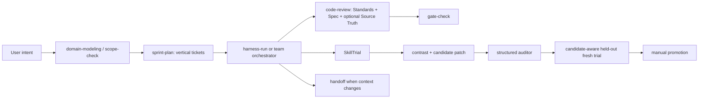

# RTS Agent Skills Workflow Alignment Implementation Plan

> **For agentic workers:** REQUIRED SUB-SKILL: Use `systematic-debugging`, `test-driven-development`, and `code-review` while implementing this plan task-by-task. Steps use checkbox (`- [ ]`) syntax for tracking.

**Goal:** Absorb the high-value engineering workflow ideas from `mattpocock/skills` into the existing RTS development-skill registry, trace, auditor, held-out, and promotion pipeline without replacing AgentScope runtime agents or creating a second skill platform.

**Architecture:** Keep `.agents/skills` as the development-skill source, `harness/skills/registry.json` as auditable metadata, `SkillTrial` as execution evidence, and SkillEvolver as the only candidate comparison and promotion path. Add invocation/composition semantics, RTS domain language, vertical task fixtures, dual-axis review, structured handoff, and candidate-aware held-out validation. Business changes remain separate `harness-run` tasks and never occur during skill promotion.

**Tech Stack:** Python 3.11, JSON Schema draft-07, pytest, Markdown skills, Hermes/Codex fresh-agent traces, existing RTS four-layer architecture, Godot 4.x validation commands.

---

## 1. Source Baseline And Attribution

External source:

- Repository: <https://github.com/mattpocock/skills>
- Pinned `main` commit for this plan: `2ab958093e83e0ec752e6c1c5932da465bf23e0c`
- License: MIT, copyright Matt Pocock
- Referenced methods: invocation separation, domain glossary, tracer-bullet tickets, tight debugging loops, dual-axis review, handoff, progressive disclosure, and explicit completion criteria

Do not copy the external repository into this project. Adapt the methods to the local architecture and preserve attribution if substantial source text is reused.

## 2. Current Baseline

At plan creation:

- Project branch: `main`
- Project `HEAD`: `2dbcf66`
- Local skills: 22
- Registry entries: 22
- Skills with held-out suites: 4
- Skills with non-null `last_evolved`: 1
- Registry validator: PASS
- Focused Harness tests: 42 PASS
- Current held-out limitation: `validate_held_out()` runs repository commands but does not execute the candidate skill, so a passing result is not sufficient promotion evidence
- Current review limitation: local `code-review` checks standards and architecture but does not independently check the originating specification
- Current workflow limitation: plans can contain sequential Tasks, but task fixtures do not express blockers, verification seams, evidence outputs, or status
- Current state-drift example: commit `2dbcf66` completes combat Tasks 8-9 while `docs/reports/sc1-combat-differentiation-remediation-qa.md` still reports those tasks as partial

## 3. Scope And Safety Boundaries

### Allowed direct changes

- `.agents/skills/*`
- `CONTEXT-MAP.md`
- `docs/domain/*`
- `docs/agents/*`
- `docs/references/*`
- `harness/skills/*`
- `harness/trace/*`
- `harness/evolve/*`
- `tests/harness/*`
- Skill-alignment reports and plans under `docs/`

### Forbidden direct changes

- `simcore/*`
- `agents/*`
- `godot/scripts/*`
- `proto/*`
- SC1 proprietary MPQ, DAT, TBL, BIN, GRP, WAV, or extracted commercial assets
- Model weights
- Existing unrelated files under `harness/output/`, `tmp/`, replay output, generated HTML, or protobuf output

If skill evidence suggests a business-code change, create a separate implementation fixture and stop the SkillEvolver run.

## 4. Updated Skill List

Invocation modes:

- `user`: only a user or top-level execution request starts the skill
- `model`: another skill or the agent may invoke it as a reusable discipline
- `both`: user-accessible and composable by an orchestrator

Skill kinds:

- `orchestrator`: coordinates other skills or agents
- `discipline`: reusable execution behavior
- `domain`: owns specialized technical knowledge
- `gate`: returns a formal readiness or correctness verdict

| # | Skill | Action | Invocation | Kind | Composes | Held-out after plan |
|---:|---|---|---|---|---|---|
| 1 | `architecture-decision` | Metadata update | both | discipline | none | no |
| 2 | `balance-check` | Metadata + held-out | model | gate | none | yes |
| 3 | `brainstorm` | Metadata update | user | orchestrator | `domain-modeling` | no |
| 4 | `code-review` | Major update | both | discipline | none | yes |
| 5 | `estimate` | Update metadata | model | discipline | none | no |
| 6 | `gate-check` | Metadata + held-out | both | gate | none | yes |
| 7 | `godot-gdextension-specialist` | Update metadata | model | domain | none | no |
| 8 | `godot-gdscript-specialist` | Metadata + held-out | model | domain | none | yes |
| 9 | `godot-shader-specialist` | Update metadata | model | domain | none | no |
| 10 | `godot-specialist` | Metadata update | both | orchestrator | `godot-gdscript-specialist`, `godot-gdextension-specialist`, `godot-shader-specialist`, `code-review` | existing |
| 11 | `harness-run` | Major update | user | orchestrator | `test-matrix`, `replay-analyze`, `code-review` | existing, strengthen |
| 12 | `milestone-review` | Metadata update | both | gate | none | no |
| 13 | `replay-analyze` | Metadata + held-out | both | domain | none | yes |
| 14 | `scope-check` | Update metadata | model | gate | none | no |
| 15 | `setup-engine` | Metadata update | user | orchestrator | `architecture-decision` | no |
| 16 | `sprint-plan` | Major update | user | orchestrator | `scope-check`, `estimate` | yes |
| 17 | `team-ai` | Metadata update | user | orchestrator | `test-matrix`, `replay-analyze`, `balance-check`, `code-review` | existing |
| 18 | `team-balance` | Metadata update | user | orchestrator | `balance-check`, `test-matrix`, `replay-analyze`, `code-review` | no |
| 19 | `team-release` | Metadata update | user | orchestrator | `milestone-review`, `gate-check`, `code-review` | no |
| 20 | `team-simcore` | Metadata update | user | orchestrator | `test-matrix`, `replay-analyze`, `code-review` | existing |
| 21 | `tech-debt` | Update metadata | both | discipline | none | no |
| 22 | `test-matrix` | Update metadata | model | discipline | none | no |
| 23 | `domain-modeling` | Create | both | discipline | none | yes |
| 24 | `handoff` | Create | user | discipline | none | yes |

### External Skill Disposition

All 22 active external skills have an explicit disposition. This plan adapts methods, not package structure.

| Disposition | External skills | Local destination |
|---|---|---|
| High value, implement now | `code-review` | Upgrade local `code-review` to independent Standards, Specification, and conditional Source Truth axes |
| High value, implement now | `diagnosing-bugs`, `tdd`, `implement` | Merge tight-loop, red-green-regression, and closeout behavior into `harness-run` |
| High value, implement now | `domain-modeling` | Add one RTS-specific `domain-modeling` skill and bounded-context glossaries |
| High value, implement now | `research` | Require pinned primary-source artifacts in task fixtures, source notes, and Source Truth review |
| High value, implement now | `to-spec`, `to-tickets` | Add `source_spec`, vertical tickets, blockers, seams, and evidence to sprint/task fixtures |
| High value, implement now | `handoff` | Add one structured, temporary handoff artifact |
| High value, implement now | `writing-great-skills` | Add invocation semantics, completion criteria, composition validation, and candidate-aware evaluation |
| Adapt selectively | `codebase-design` | Keep architecture and module-depth checks inside the Standards review axis |
| Adapt selectively | `grill-with-docs` | Use scenario-driven terminology checks inside `domain-modeling`; do not force an interview for routine tasks |
| Adapt selectively | `improve-codebase-architecture` | Keep deepening recommendations under `tech-debt`; do not add an HTML-report dependency in this phase |
| Adapt selectively | `prototype` | Use existing Godot Test Mode and task fixtures for questions that need throwaway visual or logic probes |
| Adapt selectively | `resolving-merge-conflicts` | Put intent sources, fixed point, and unresolved conflicts in handoff/stop conditions; no new merge skill in this phase |
| Adapt selectively | `triage` | Reuse its state-machine idea through fixture status and blocker validation |
| Adapt selectively | `wayfinder` | Reuse decision and blocker graphs for work larger than one fresh context |
| Do not add | `ask-matt` | Existing Registry metadata and project navigation already route skills |
| Do not add | `setup-matt-pocock-skills` | Task 0-2 perform a one-time local migration without external setup conventions |
| Do not add | `grill-me`, `grilling` | High interaction cost and overlap with domain-modeling/brainstorming |
| Do not add | `teach` | Outside the software-delivery and SkillEvolver objective |

Target after completion:

- 24 registered skills
- 24 skills with explicit invocation mode, kind, and completion criteria
- 12 skills with held-out suites, 50% coverage
- No unknown composition edge and no composition cycle
- No development skill imported by AgentScope runtime code

## 5. Target Workflow



## 6. Execution Rules

1. Execute exactly one Task per fresh agent context.
2. Start from the earliest unchecked Task whose dependency Gate is PASS.
3. Before each Task, run `git status --short` and record unrelated dirty paths; do not stage them.
4. Demonstrate a failing targeted test before implementation unless the Task only creates documentation.
5. Commit each completed Task separately with the specified message.
6. Update this plan's checkboxes and the alignment report in the same Task commit.
7. Never mark a Gate PASS from file existence or import success alone when behavioral evidence is required.
8. Never manufacture Hermes/Codex fresh-agent traces. If no runner is available, mark the Gate BLOCKED and preserve generated packets.
9. Skill promotion remains dry-run by default. Applying a candidate requires explicit `--apply` and manual approval.
10. Stop if the source baseline, layer boundary, or current user changes conflict with a planned edit.

---

## Task 0: Record The Alignment Baseline

**Depends on:** none

**Files:**

- Create: `docs/references/mattpocock-skills-source-note.md`
- Create: `docs/reports/agent-skills-workflow-alignment.md`
- Modify: `docs/plans/2026-08-04-agent-skills-workflow-alignment-execution-plan.md`

- [x] **Step 1: Capture repository state without modifying it**

Run:

```bash
git branch --show-current
git rev-parse HEAD
git status --short
python3 harness/skills/validate_registry.py
python3 -m pytest tests/harness/test_skill_evolver.py tests/harness/test_trace_validation.py tests/harness/test_strategy_runner.py tests/harness/test_skill_auditor.py -q
```

Expected:

- Registry validator exits 0.
- Harness tests exit 0.
- Existing unrelated dirty files remain unstaged.

- [x] **Step 2: Write the external source note**

The source note must contain the repository URL, pinned commit, MIT license URL, methods adapted, files influenced, and a statement that no runtime AgentScope logic is derived from the external repository.

- [x] **Step 3: Write the baseline report**

Use this status table:

```markdown
| Gate | Initial status | Evidence |
|---|---|---|
| A0 Source pin | PASS | external commit and license recorded |
| A1 Registry semantics | FAIL | invocation_mode, skill_kind, composes, completion_criteria absent |
| A2 Domain language | FAIL | no CONTEXT-MAP.md or bounded-context glossaries |
| A3 Review workflow | FAIL | code-review has no independent Spec axis |
| A4 Vertical execution | FAIL | task schema has no blockers or verification seams |
| A5 Handoff | FAIL | no structured handoff skill |
| A6 Candidate held-out | FAIL | candidate patch is not executed during held-out |
| A7 Coverage | FAIL | 4/22 skills have held-out suites |
| A8 Fresh-agent proof | BLOCKED | no alignment pilot trials yet |
```

- [x] **Step 4: Commit the baseline**

```bash
git add docs/references/mattpocock-skills-source-note.md docs/reports/agent-skills-workflow-alignment.md docs/plans/2026-08-04-agent-skills-workflow-alignment-execution-plan.md
git commit -m "docs: record agent skills alignment baseline"
```

### Gate A0

PASS only when source pin, attribution, test baseline, dirty-file exclusions, and all initial Gate statuses are recorded.

---

## Task 1: Add Registry Invocation And Composition Semantics

**Depends on:** Gate A0 PASS

**Files:**

- Modify: `harness/skills/schema.json`
- Modify: `harness/skills/registry.json`
- Modify: `harness/skills/validate_registry.py`
- Modify: `tests/harness/test_skill_evolver.py`
- Create: `tests/harness/test_skill_registry_semantics.py`
- Modify: `docs/reports/agent-skills-workflow-alignment.md`

- [x] **Step 1: Write failing schema tests**

Add tests asserting that these fields are required:

```python
def test_registry_requires_workflow_semantics():
    schema = json.loads(SCHEMA_PATH.read_text())
    required = set(schema["required"])
    assert {"invocation_mode", "skill_kind", "completion_criteria"} <= required


def test_registry_semantic_enums_are_closed():
    schema = json.loads(SCHEMA_PATH.read_text())
    props = schema["properties"]
    assert props["invocation_mode"]["enum"] == ["user", "model", "both"]
    assert props["skill_kind"]["enum"] == ["orchestrator", "discipline", "domain", "gate"]
```

Run:

```bash
python3 -m pytest tests/harness/test_skill_registry_semantics.py -q
```

Expected: FAIL because the fields do not exist.

- [x] **Step 2: Extend the JSON Schema**

Add these properties and make the first three required:

```json
"invocation_mode": {
  "type": "string",
  "enum": ["user", "model", "both"]
},
"skill_kind": {
  "type": "string",
  "enum": ["orchestrator", "discipline", "domain", "gate"]
},
"completion_criteria": {
  "type": "array",
  "items": {"type": "string", "minLength": 1},
  "minItems": 1
},
"composes": {
  "type": "array",
  "items": {"type": "string", "pattern": "^[a-z][a-z0-9-]+$"},
  "uniqueItems": true,
  "default": []
}
```

- [x] **Step 3: Add composition validation tests**

Cover all of these behaviors:

```python
def test_composition_targets_exist(): ...
def test_composition_graph_has_no_cycles(): ...
def test_non_orchestrator_has_no_composition_edges(): ...
def test_model_skill_does_not_require_user_only_child(): ...
def test_all_skills_have_nonempty_completion_criteria(): ...
```

The validator must return deterministic issue codes containing the skill name and offending edge.

- [x] **Step 4: Implement registry graph validation**

Add a helper with this interface:

```python
def validate_composition(registry: list[dict]) -> list[str]:
    """Validate target existence, kind restrictions, invocation compatibility, and cycles."""
```

Rules:

1. Every `composes` target exists.
2. Only `orchestrator` entries may have non-empty `composes`.
3. A `model` orchestrator cannot require a `user`-only child.
4. The directed composition graph is acyclic.
5. A skill cannot compose itself.

- [ ] **Step 5: Migrate all 22 registry entries**

Use the table in section 4 as the final mapping, with one migration exception: keep `brainstorm.composes=[]` until `domain-modeling` is created in Task 2. Add one or more externally observable completion criteria to every entry. Examples:

```json
"completion_criteria": [
  "targeted validation commands exit 0",
  "reported evidence references the originating task or specification"
]
```

Do not change `version` or `last_evolved` in this migration; no skill behavior has evolved yet.

- [ ] **Step 6: Verify and commit**

```bash
python3 harness/skills/validate_registry.py
python3 -m pytest tests/harness/test_skill_registry_semantics.py tests/harness/test_skill_evolver.py -q
git diff --check
git add harness/skills/schema.json harness/skills/registry.json harness/skills/validate_registry.py tests/harness/test_skill_registry_semantics.py tests/harness/test_skill_evolver.py docs/reports/agent-skills-workflow-alignment.md
git commit -m "feat: add skill invocation and composition semantics"
```

### Gate A1

PASS only when 22/22 entries validate, all composition tests pass, and the graph is acyclic.

---

## Task 2: Establish RTS Domain Language And Domain Modeling

**Depends on:** Gate A1 PASS

**Files:**

- Create: `CONTEXT-MAP.md`
- Create: `docs/domain/simcore-context.md`
- Create: `docs/domain/godot-presentation-context.md`
- Create: `docs/domain/skill-harness-context.md`
- Create: `docs/domain/sc1-source-truth-context.md`
- Create: `.agents/skills/domain-modeling/SKILL.md`
- Modify: `harness/skills/registry.json`
- Create: `tests/harness/test_domain_contexts.py`
- Modify: `docs/reports/agent-skills-workflow-alignment.md`

- [x] **Step 1: Write failing context contract tests**

The test must assert that the map references all four context files and that each glossary contains required canonical terms:

```python
REQUIRED_TERMS = {
    "simcore-context.md": ["Authoritative Game State", "CombatEvent", "Determinism", "Production Entity"],
    "godot-presentation-context.md": ["Presentation State", "CombatVisualController", "Test Mode Fixture", "Visual Manifest"],
    "skill-harness-context.md": ["SkillTrial", "Candidate Patch", "Silent Bypass", "Held-out Trial", "Promotion"],
    "sc1-source-truth-context.md": ["Effective MPQ Overlay", "Semantic Weapon ID", "Reference Artifact", "Presentation Asset"],
}
```

Run and confirm failure:

```bash
python3 -m pytest tests/harness/test_domain_contexts.py -q
```

- [x] **Step 2: Create the context map**

`CONTEXT-MAP.md` must contain only context boundaries, owner, canonical glossary path, and permitted dependencies. It must restate the project dependency direction:

```text
Proto -> SimCore -> Agents -> Frontend/Godot
Development Harness observes all layers but promoted skill patches cannot mutate runtime business code.
```

- [x] **Step 3: Create four glossaries**

Each entry must use this shape:

```markdown
## Canonical Term

Definition: domain meaning without implementation detail.

Not the same as: overloaded or rejected term.

Boundary example: one concrete scenario that distinguishes the terms.
```

Glossaries must not contain file paths, function signatures, implementation plans, or mutable task status.

- [x] **Step 4: Create the domain-modeling skill**

The skill process must be:

1. Read `CONTEXT-MAP.md` and the relevant glossary.
2. Detect vague or conflicting terminology in the request, specification, and code behavior.
3. Test the proposed language with at least two concrete edge scenarios.
4. Update the glossary immediately when a term is resolved.
5. Offer an ADR only when the choice is hard to reverse, surprising without context, and involves a real trade-off.
6. Finish only when terminology, scenarios, and any code/document disagreement are recorded.

It must not modify runtime code.

- [x] **Step 5: Register skill 23**

Use:

```json
{
  "name": "domain-modeling",
  "invocation_mode": "both",
  "skill_kind": "discipline",
  "composes": [],
  "owner_domain": "cross-cutting",
  "layer_constraints": ["dev-harness"]
}
```

Do not add the `architecture-decision` composition edge because only orchestrators may compose under Task 1. Instead, the skill may recommend that the user invoke it separately. In the same registry edit, set `brainstorm.composes=["domain-modeling"]` now that the target exists.

- [x] **Step 6: Verify and commit**

```bash
python3 -m pytest tests/harness/test_domain_contexts.py -q
python3 harness/skills/validate_registry.py
git diff --check
git add CONTEXT-MAP.md docs/domain .agents/skills/domain-modeling harness/skills/registry.json tests/harness/test_domain_contexts.py docs/reports/agent-skills-workflow-alignment.md
git commit -m "feat: add RTS domain context model"
```

### Gate A2

PASS only when all four contexts are linked, required terms are unambiguous, and registry count is 23.

---

## Task 3: Upgrade Code Review To Standards And Specification Axes

**Depends on:** Gate A2 PASS

**Files:**

- Modify: `.agents/skills/code-review/SKILL.md`
- Modify: `harness/skills/registry.json`
- Create: `tests/harness/test_code_review_skill_contract.py`
- Create: `harness/skills/tasks/code-review/combat-remediation-review.json`
- Modify: `docs/reports/agent-skills-workflow-alignment.md`

- [x] **Step 1: Write failing content-contract tests**

Tests must require these review phases and outputs:

```python
REQUIRED_HEADINGS = [
    "Pin The Fixed Point",
    "Locate The Originating Specification",
    "Standards Axis",
    "Specification Axis",
    "Source Truth Axis",
    "Independent Verdicts",
]
```

Also assert the skill uses `git diff <fixed-point>...HEAD`, does not require a subagent tool, and does not merge the axis verdicts into one score.

- [x] **Step 2: Replace the review input contract**

Use:

```text
argument-hint: "[fixed-point] [spec-path-or-issue]"
```

If the fixed point is omitted, use the merge-base with the current upstream branch when it can be resolved unambiguously; otherwise stop and request the fixed point.

- [x] **Step 3: Implement the three review axes in the skill text**

Required behavior:

1. Standards axis checks `AGENTS.md`, architecture boundaries, local conventions, and game hot paths.
2. Specification axis reports missing, partial, incorrect, and out-of-scope behavior against the originating plan or issue.
3. Source Truth axis runs only when a plan declares an external authority such as SC1 DAT/OpenBW, protobuf contract, replay hash, or generated fixture.
4. Axes may run in parallel when the executor supports it, otherwise sequentially with separate notes.
5. Findings are ordered by severity within each axis and cite file/line or specification section.

Required output:

```markdown
## Standards
Verdict: PASS | CONCERNS | FAIL

## Specification
Verdict: PASS | CONCERNS | FAIL | NOT AVAILABLE

## Source Truth
Verdict: PASS | CONCERNS | FAIL | NOT APPLICABLE

## Summary
Standards findings: N; Specification findings: N; Source Truth findings: N.
```

- [x] **Step 4: Add the combat-remediation review fixture**

The fixture must compare `2dbcf66` with the remediation plan and QA report. Its pass criteria must include detecting that Task 8-9 implementation status and QA status disagree. The fixture is a development-process test and must forbid modifications under `simcore/`, `agents/`, `godot/scripts/`, and `proto/`.

- [ ] **Step 5: Update registry metadata and version**

Set `code-review.version` to `0.2.0`; add completion criteria requiring all applicable axes and a fixed-point diff.

- [ ] **Step 6: Verify and commit**

```bash
python3 -m pytest tests/harness/test_code_review_skill_contract.py tests/harness/test_strategy_runner.py -q
python3 harness/skills/validate_registry.py
git diff --check
git add .agents/skills/code-review harness/skills/registry.json harness/skills/tasks/code-review tests/harness/test_code_review_skill_contract.py docs/reports/agent-skills-workflow-alignment.md
git commit -m "feat: add specification-aware code review"
```

### Gate A3

PASS only when the skill can report a Standards PASS and Specification FAIL independently and the fixture captures the known QA drift.

---

## Task 4: Add Vertical Ticket Semantics To Task Fixtures

**Depends on:** Gate A3 PASS

**Files:**

- Modify: `harness/skills/tasks/schema.json`
- Modify: `harness/skills/tasks/godot-vfx/sc1-resource-alignment.json`
- Modify: `harness/skills/tasks/code-review/combat-remediation-review.json`
- Create: `harness/skills/validate_tasks.py`
- Modify: `harness/evolve/strategy_runner.py`
- Modify: `tests/harness/test_strategy_runner.py`
- Create: `tests/harness/test_task_graph.py`
- Modify: `docs/reports/agent-skills-workflow-alignment.md`

- [x] **Step 1: Write failing task-schema tests**

Make these fields required:

```json
"source_spec",
"blocked_by",
"acceptance_criteria",
"verification_seams",
"evidence_outputs",
"status"
```

`status` must be one of `blocked`, `ready`, `in_progress`, `verification`, `done`.

- [x] **Step 2: Extend the fixture schema**

Use arrays of non-empty strings for blockers, acceptance criteria, seams, and evidence outputs. `source_spec` is a repository-relative path. Require at least one acceptance criterion, seam, and evidence output.

- [x] **Step 3: Implement task graph validation**

`harness/skills/validate_tasks.py` must:

1. Load every JSON fixture below `harness/skills/tasks`, excluding `schema.json`.
2. Validate each fixture against the schema.
3. Reject unknown blockers and cycles.
4. Reject `ready` when any blocker is not `done`.
5. Reject source specs outside the repository or missing on disk.
6. Reject fixture paths that overlap their own `forbidden_paths`.
7. Print `OK - all task fixtures pass validation` and exit 0 on success.

- [x] **Step 4: Migrate existing fixtures**

The Godot VFX fixture and combat review fixture both use an empty `blocked_by` list and `status=ready`. Their implementation ordering is controlled by this plan's Gates; fixture blockers may reference only other fixture IDs.

- [ ] **Step 5: Render task semantics in strategy packets**

Add these packet sections before `Validation Commands`:

```markdown
## Source Specification
## Blocked By
## Acceptance Criteria
## Verification Seams
## Evidence Outputs
## Stop Condition
```

The stop condition must tell the agent to execute only the current fixture and stop after evidence is recorded.

- [ ] **Step 6: Verify and commit**

```bash
python3 harness/skills/validate_tasks.py
python3 -m pytest tests/harness/test_strategy_runner.py tests/harness/test_task_graph.py -q
git diff --check
git add harness/skills/tasks harness/skills/validate_tasks.py harness/evolve/strategy_runner.py tests/harness/test_strategy_runner.py tests/harness/test_task_graph.py docs/reports/agent-skills-workflow-alignment.md
git commit -m "feat: add vertical task fixture graph"
```

### Gate A4-schema

PASS only when every task is a complete, independently verifiable slice with explicit evidence and no graph violation.

---

## Task 5: Align Sprint Planning And Harness Execution

**Depends on:** Gate A4-schema PASS

**Files:**

- Modify: `.agents/skills/sprint-plan/SKILL.md`
- Modify: `.agents/skills/harness-run/SKILL.md`
- Modify: `harness/skills/registry.json`
- Create: `tests/harness/test_execution_skill_contracts.py`
- Modify: `docs/reports/agent-skills-workflow-alignment.md`

- [x] **Step 1: Write failing execution-contract tests**

The sprint skill must contain `vertical slice`, `blocked_by`, `verification_seams`, and `evidence_outputs`. The Harness skill must contain `red-capable`, `minimise`, `one hypothesis at a time`, `regression`, and `handoff`.

- [x] **Step 2: Replace horizontal sprint tasks with vertical tickets**

Each sprint item must include:

```markdown
### Ticket N: user-visible or operator-visible outcome
Status: blocked | ready | in_progress | verification | done
Blocked by: fixture IDs or None
Source specification: repository path
What it delivers: end-to-end behavior
Acceptance criteria: externally observable assertions
Verification seams: highest stable interface used for tests
Evidence outputs: report, trace, replay, screenshot, or test log paths
Owner skill: one orchestrator
```

Do not decompose a ticket into one ticket per architectural layer. A ticket may cross Proto, SimCore, gRPC, and Godot when that is the narrowest independently demonstrable path.

- [x] **Step 3: Add the tight feedback loop to harness-run**

The execution order must be:

1. Read source specification, domain context, ADR, and current fixture.
2. Build one fast, deterministic, agent-runnable command that can detect the exact failure.
3. Reproduce and minimise.
4. Record 3-5 falsifiable hypotheses for hard defects.
5. Test one hypothesis at a time with targeted instrumentation.
6. Convert the minimal reproducer into a regression test at the highest stable seam.
7. Implement the smallest fix.
8. Run targeted tests, architecture checks, then the relevant full suite.
9. Run `code-review` against the fixture source specification.
10. Update evidence and task status in the same commit.

- [x] **Step 4: Remove non-project examples**

Remove hardcoded S3, MLflow, fabricated run IDs, and synthetic progress examples from `harness-run`. Replace them with references to the actual output locations configured by this repository.

- [ ] **Step 5: Update versions and verify**

Set `sprint-plan.version` and `harness-run.version` to `0.2.0`.

```bash
python3 -m pytest tests/harness/test_execution_skill_contracts.py -q
python3 harness/skills/validate_registry.py
git diff --check
git add .agents/skills/sprint-plan .agents/skills/harness-run harness/skills/registry.json tests/harness/test_execution_skill_contracts.py docs/reports/agent-skills-workflow-alignment.md
git commit -m "feat: align planning and harness execution workflow"
```

### Gate A4

PASS only when sprint output can be converted to fixtures without inventing missing blocker, seam, or evidence fields, and harness-run has a red-capable completion criterion.

---

## Task 6: Add Structured Agent Handoff

**Depends on:** Gate A4 PASS

**Files:**

- Create: `.agents/skills/handoff/SKILL.md`
- Create: `docs/agents/templates/agent-handoff-template.md`
- Modify: `harness/skills/registry.json`
- Create: `tests/harness/test_handoff_skill_contract.py`
- Modify: `docs/reports/agent-skills-workflow-alignment.md`

- [x] **Step 1: Write failing handoff tests**

Require the template and skill to cover:

```python
REQUIRED = [
    "Objective",
    "Fixed Point",
    "Active Task Fixture",
    "Gate Status",
    "Completed Evidence",
    "Current Failure",
    "Unrelated Working Tree Paths",
    "Next Command",
    "Suggested Skills",
    "Stop Conditions",
]
```

Also reject headings named `Conversation Dump` or sections containing credentials.

- [x] **Step 2: Create the handoff template**

The template must reference existing plans, commits, reports, diffs, and fixtures by path rather than duplicating their contents. It must contain one executable next command and one active task only.

- [x] **Step 3: Create the handoff skill**

The skill writes to the operating-system temporary directory using the filename `rts-agent-handoff-<task-id>.md`. It must redact secrets, avoid copying proprietary asset paths outside the repository, and state when the working tree contains unrelated changes.

- [x] **Step 4: Register skill 24**

Use `invocation_mode=user`, `skill_kind=discipline`, `owner_domain=cross-cutting`, and `layer_constraints=[dev-harness]`. Completion requires all template sections and a valid next command.

- [ ] **Step 5: Verify and commit**

```bash
python3 -m pytest tests/harness/test_handoff_skill_contract.py -q
python3 harness/skills/validate_registry.py
git diff --check
git add .agents/skills/handoff docs/agents/templates/agent-handoff-template.md harness/skills/registry.json tests/harness/test_handoff_skill_contract.py docs/reports/agent-skills-workflow-alignment.md
git commit -m "feat: add structured agent handoff skill"
```

### Gate A5

PASS only when registry count is 24 and a fresh agent can identify the exact next task without reading conversation history.

---

## Task 7: Make Held-Out Validation Candidate-Aware

**Depends on:** Gate A5 PASS

**Files:**

- Create: `harness/evolve/held_out.py`
- Modify: `harness/evolve/skill_evolver.py`
- Modify: `harness/evolve/auditor.py`
- Modify: `harness/trace/schema.py`
- Modify: `harness/trace/validate_traces.py`
- Create: `tests/harness/test_candidate_held_out.py`
- Modify: `tests/harness/test_skill_evolver.py`
- Modify: `tests/harness/test_trace_validation.py`
- Modify: `docs/agents/skill-evolver-hermes-operation-manual.md`
- Modify: `docs/reports/agent-skills-workflow-alignment.md`

- [x] **Step 1: Write failing promotion-safety tests**

Cover these cases:

```python
def test_command_only_held_out_is_not_promotion_eligible(): ...
def test_baseline_trial_cannot_validate_candidate(): ...
def test_candidate_trial_requires_candidate_id(): ...
def test_candidate_trial_requires_fresh_agent_run_id(): ...
def test_training_fixture_cannot_be_reused_as_held_out(): ...
def test_promotion_requires_candidate_aware_pass(): ...
```

Run:

```bash
python3 -m pytest tests/harness/test_candidate_held_out.py -q
```

Expected: FAIL because the current held-out function does not receive candidate evidence.

- [x] **Step 2: Introduce a structured held-out result**

Implement:

```python
@dataclass
class HeldOutResult:
    passed: bool
    promotion_eligible: bool
    skill_name: str
    candidate_id: str
    scenario_results: list[dict]
    issues: list[str]
```

Command-only validation may set `passed=True`, but must always set `promotion_eligible=False`.

- [x] **Step 3: Make candidate identity mandatory in traces**

For `baseline_or_candidate == "candidate"`, strict trace validation must require:

- non-empty `candidate_id`
- non-empty `agent_run_id`
- a held-out `task_fixture_id`
- `skill_md_read=True`
- `primary_action_invoked=True`
- at least one validation command and exit code
- functional verification equal to `pass`
- outcome equal to `pass`

- [x] **Step 4: Validate against a candidate overlay**

The held-out module must create a temporary skill overlay containing the current `SKILL.md` plus the candidate patch. The generated packet must point the fresh runner to the overlay, not the repository skill. The overlay is temporary and must never be committed.

- [ ] **Step 5: Harden promotion**

Change promotion input from a Boolean to `HeldOutResult`. Promotion is allowed only when:

```python
audit.accepted and held_out.passed and held_out.promotion_eligible
```

Preserve dry-run as the default. If no fresh runner or recorded candidate trial is available, print `BLOCKED - candidate-aware held-out evidence unavailable` and leave `SKILL.md` unchanged.

- [ ] **Step 6: Update the operation manual**

Clearly distinguish:

- repository validation: catches broken code but cannot prove a skill improvement
- baseline fresh trial: measures current behavior
- candidate fresh held-out trial: required for promotion
- manual promotion approval: final control point

- [ ] **Step 7: Verify and commit**

```bash
python3 -m pytest tests/harness/test_candidate_held_out.py tests/harness/test_skill_evolver.py tests/harness/test_trace_validation.py -q
python3 harness/trace/validate_traces.py --strict
git diff --check
git add harness/evolve/held_out.py harness/evolve/skill_evolver.py harness/evolve/auditor.py harness/trace/schema.py harness/trace/validate_traces.py tests/harness/test_candidate_held_out.py tests/harness/test_skill_evolver.py tests/harness/test_trace_validation.py docs/agents/skill-evolver-hermes-operation-manual.md docs/reports/agent-skills-workflow-alignment.md
git commit -m "fix: require candidate-aware held-out evidence"
```

### Gate A6

PASS only when an accepted patch plus command-only repository tests cannot promote, while a valid fresh candidate held-out trial can reach manual approval.

---

## Task 8: Expand And Strengthen Held-Out Coverage

**Depends on:** Gate A6 PASS

**Files:**

- Modify: `harness/skills/held_out/godot-specialist/suite.json`
- Modify: `harness/skills/held_out/harness-run/suite.json`
- Modify: `harness/skills/held_out/team-ai/suite.json`
- Modify: `harness/skills/held_out/team-simcore/suite.json`
- Create: `harness/skills/held_out/schema.json`
- Create: `harness/skills/held_out/code-review/suite.json`
- Create: `harness/skills/held_out/gate-check/suite.json`
- Create: `harness/skills/held_out/replay-analyze/suite.json`
- Create: `harness/skills/held_out/balance-check/suite.json`
- Create: `harness/skills/held_out/sprint-plan/suite.json`
- Create: `harness/skills/held_out/godot-gdscript-specialist/suite.json`
- Create: `harness/skills/held_out/domain-modeling/suite.json`
- Create: `harness/skills/held_out/handoff/suite.json`
- Create: `harness/skills/validate_held_out_suites.py`
- Modify: `harness/skills/registry.json`
- Create: `tests/harness/test_held_out_coverage.py`
- Modify: `docs/reports/agent-skills-workflow-alignment.md`

- [x] **Step 1: Write failing coverage tests**

Require:

```python
assert registered_skill_count == 24
assert held_out_skill_count >= 12
assert held_out_skill_count / registered_skill_count >= 0.50
```

Every suite must have at least two scenarios, unique IDs, a `task_fixture_id` prefixed with `held-out/<skill-name>/`, behavioral pass criteria, and at least one exact validation command. Held-out scenarios are self-contained fixtures inside `suite.json`; do not point them at training fixture files. Encode these requirements in `harness/skills/held_out/schema.json` and validate all suites from `harness/skills/validate_held_out_suites.py`.

- [x] **Step 2: Strengthen existing suites**

Replace checks such as “file exists” and “module imports” with behavior that can fail for the scenario. Examples:

- Harness execution: a deliberately failing fixture must remain failed until its exact assertion is repaired.
- Team SimCore: same seed and command stream produce the same replay hash across processes.
- Team AI: at least two map seeds and a baseline opponent produce legal commands and expected metrics.
- Godot specialist: manifest, fixture freshness, and event consumption are checked separately.

- [x] **Step 3: Add eight new suites**

Minimum scenarios:

| Skill | Scenario 1 | Scenario 2 |
|---|---|---|
| code-review | standards violation with spec pass | spec violation with standards pass |
| gate-check | automatic evidence PASS | missing manual evidence yields CONCERNS or FAIL |
| replay-analyze | deterministic replay | corrupted or divergent replay |
| balance-check | normal progression | dominant or degenerate configuration |
| sprint-plan | independent vertical tickets | invalid blocker cycle |
| godot-gdscript-specialist | typed script contract | event ownership regression |
| domain-modeling | overloaded term conflict | context boundary disagreement |
| handoff | complete single-task handoff | stale or missing next command |

Do not reuse training fixture IDs from `harness/skills/tasks` as held-out IDs.

- [x] **Step 4: Update registry suite paths**

Set `held_out_suite` for all 12 covered skills. Do not change `last_evolved`.

- [ ] **Step 5: Verify and commit**

```bash
python3 -m pytest tests/harness/test_held_out_coverage.py -q
python3 harness/skills/validate_registry.py
python3 harness/skills/validate_tasks.py
python3 harness/skills/validate_held_out_suites.py
git diff --check
git add harness/skills/held_out harness/skills/validate_held_out_suites.py harness/skills/registry.json tests/harness/test_held_out_coverage.py docs/reports/agent-skills-workflow-alignment.md
git commit -m "test: expand skill held-out coverage"
```

### Gate A7

PASS only when at least 12/24 skills have behavioral held-out suites and none rely solely on existence/import checks.

---

## Task 9: Run A Real Code-Review Skill Improvement Pilot

**Depends on:** Gate A7 PASS

**Files:**

- Modify: `harness/skills/tasks/code-review/combat-remediation-review.json`
- Generate: `harness/skills/candidates/strategy_runs/<run-id>/*`
- Generate: `harness/trace/trials/<date>.jsonl`
- Generate: `harness/skills/candidates/code-review/<timestamp>/*`
- Modify: `docs/reports/agent-skills-workflow-alignment.md`

Generated candidate and trace paths follow existing ignore rules unless the repository explicitly tracks evidence summaries. Do not force-add ignored raw traces.

- [x] **Step 1: Validate the pilot fixture**

```bash
python3 harness/skills/validate_tasks.py
```

The pilot must review the combat remediation implementation against:

- `docs/plans/2026-08-03-sc1-combat-differentiation-remediation-plan.md`
- `docs/reports/sc1-combat-differentiation-remediation-qa.md`
- fixed point `e201355`
- target `2dbcf66`

- [x] **Step 2: Generate baseline strategy packets**

```bash
python3 -m harness.evolve.strategy_runner harness/skills/tasks/code-review/combat-remediation-review.json --run-id code-review-alignment-baseline-001
```

Expected: one packet per configured strategy and a `run_manifest.json`.

- [x] **Step 3: Execute fresh baseline agents**

Run every packet in a fresh Hermes/Codex context. Each run must produce a SkillTrial with a unique `agent_run_id`. A valid baseline must detect the QA status drift and must not edit business code.

If no fresh runner is available, set Gate A8 to BLOCKED and stop. Synthetic traces are not accepted.

- [x] **Step 4: Generate candidate patches**

```bash
python3 -m harness.evolve.skill_evolver code-review
```

Expected: dry-run candidates only; repository `SKILL.md` remains unchanged.

- [ ] **Step 5: Audit candidate quality**

Reject any candidate that:

- embeds combat-specific unit, weapon, commit, fixture, or file assumptions as general skill rules
- removes an existing validation command
- changes runtime code
- merges Standards and Specification into one verdict
- lacks an externally checkable completion criterion

- [ ] **Step 6: Execute fresh held-out candidate agents**

Use only code-review held-out fixtures, a new `agent_run_id` per run, and the temporary candidate skill overlay. Record candidate traces with `baseline_or_candidate=candidate` and the exact candidate ID.

- [ ] **Step 7: Request manual promotion**

Only after Auditor PASS and candidate-aware held-out PASS:

```bash
python3 -m harness.evolve.skill_evolver code-review --apply
```

Before approving, inspect the patch and confirm it contains no combat-instance leakage.

- [ ] **Step 8: Record pilot metrics**

The report must compare baseline and candidate on:

- requirement findings detected
- false-positive findings
- validation commands executed
- token count
- turn count
- duration
- silent bypass
- runtime paths touched

- [ ] **Step 9: Commit tracked evidence only**

```bash
git add .agents/skills/code-review/SKILL.md harness/skills/registry.json docs/reports/agent-skills-workflow-alignment.md docs/plans/2026-08-04-agent-skills-workflow-alignment-execution-plan.md
git commit -m "feat: promote validated code review workflow"
```

Do not commit the skill file if the candidate is rejected or Gate A8 is blocked.

### Gate A8

PASS only with real baseline trials, real candidate held-out trials, independent audit acceptance, manual approval, and no runtime business-code changes.

---

## Task 10: Final Integration And Documentation Gate

**Depends on:** Gate A8 PASS

**Files:**

- Modify: `docs/agents/platform-harness-agent-operation-manual.md`
- Modify: `docs/agents/skill-evolver-hermes-operation-manual.md`
- Modify: `docs/architecture/adr-skill-evolver-harness.md`
- Modify: `docs/architecture/current-platform-architecture-report.zh.md`
- Modify: `docs/reports/agent-skills-workflow-alignment.md`
- Modify: `docs/plans/2026-08-04-agent-skills-workflow-alignment-execution-plan.md`

- [x] **Step 1: Update manuals with the new workflow**

Document:

```text
domain-modeling -> sprint-plan -> task fixture -> harness-run/team-* -> code-review -> gate-check
                                                    -> SkillTrial -> SkillEvolver -> held-out -> manual promotion
```

Include exact commands for Registry, task, trace, candidate, and held-out validation.

- [x] **Step 2: Update the ADR**

Record invocation modes, skill kinds, composition graph, candidate-aware held-out evidence, and the continued prohibition on SkillEvolver changing runtime business code.

- [x] **Step 3: Run final automated gates**

```bash
python3 harness/skills/validate_registry.py
python3 harness/skills/validate_tasks.py
python3 harness/skills/validate_held_out_suites.py
python3 harness/trace/validate_traces.py --strict
python3 -m pytest tests/harness -q
python3 scripts/lint_deps.py
git diff --check
```

Expected: all commands exit 0. A pytest deprecation warning is non-blocking only if no test fails.

- [x] **Step 4: Run final scope audit**

```bash
git diff --name-only <task-0-baseline-commit>...HEAD
```

Every changed path must fall within section 3's allowed list. Any runtime business path makes the final Gate FAIL.

- [ ] **Step 5: Close the report**

Final report must include:

- 24/24 Registry coverage
- held-out coverage count and percentage
- real fresh-agent trial count
- promoted, rejected, and blocked candidate counts
- before/after code-review pilot metrics
- known limitations
- final PASS, CONCERNS, or FAIL verdict

- [ ] **Step 6: Commit final documentation**

```bash
git add docs/agents/platform-harness-agent-operation-manual.md docs/agents/skill-evolver-hermes-operation-manual.md docs/architecture/adr-skill-evolver-harness.md docs/architecture/current-platform-architecture-report.zh.md docs/reports/agent-skills-workflow-alignment.md docs/plans/2026-08-04-agent-skills-workflow-alignment-execution-plan.md
git commit -m "docs: complete agent skills workflow alignment"
```

### Final Gate

PASS requires all of the following:

- Registry, task graph, strict trace, Harness tests, and architecture lint pass.
- 24 skills are registered with invocation semantics and completion criteria.
- At least 12 skills have behavioral held-out suites.
- At least one real skill candidate has completed baseline, contrast, audit, held-out, and manual promotion or has been correctly rejected with evidence.
- SkillEvolver has not changed runtime business code.
- The combat QA status drift is detected by the upgraded review fixture.
- Documentation reflects actual repository state rather than intended state.

---

## 7. Agent Startup Prompt

Give the executing agent this exact instruction:

```text
Read AGENTS.md, CONTEXT-MAP.md if it exists, and docs/plans/2026-08-04-agent-skills-workflow-alignment-execution-plan.md.
Execute exactly one unchecked Task, starting from the earliest Task whose dependency Gate is PASS.
Use test-driven-development for code changes and show the targeted failing test before implementation.
Do not install mattpocock/skills as a bundle. Do not modify simcore, agents, godot/scripts, proto, proprietary assets, harness/output, tmp, replay outputs, generated HTML, generated protobuf files, or unrelated user changes.
Update the Task checkboxes and docs/reports/agent-skills-workflow-alignment.md in the same task-scoped commit.
Stop at the next Gate and report using the Task Result template. Never fabricate fresh-agent traces or held-out evidence.
```

## 8. Task Result Template

```markdown
## Task N Result

Status: PASS | CONCERNS | FAIL | BLOCKED
Commit: <sha or none>
Gate: <gate name and verdict>

### Changed Files
- repository-relative path

### Red Evidence
- command
- observed failure

### Green Evidence
- command
- exit code and key assertion

### Scope Audit
- unrelated dirty paths left untouched
- forbidden runtime paths changed: none

### Remaining Work
- next unchecked Task
- blocker and required external action, when present
```

## 9. Stop Conditions

Stop immediately and do not continue to the next Task when:

1. A Gate is FAIL, CONCERNS, or BLOCKED.
2. A required fresh-agent runner is unavailable.
3. A candidate held-out run does not use the candidate overlay.
4. A planned skill patch requires runtime business-code changes.
5. Registry migration creates a composition cycle or unknown target.
6. A held-out scenario passes only because it checks file existence or importability.
7. The working tree contains conflicting user edits in a target file.
8. External source text is copied substantially without attribution.
