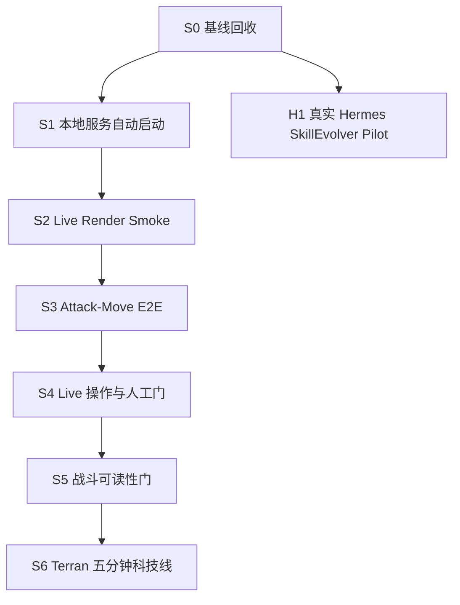

# RTS Playable Research Client Next Iteration Plan

> **For agentic workers:** REQUIRED SUB-SKILL: use `harness-run` for every implementation ticket, add the ticket owner skill named in the sprint, and use `code-review` before returning a result envelope. Execute one ticket per fresh Hermes run.

**Goal:** 建立一个从 Godot 主菜单直接启动、五分钟内可完成选择、编队、建造、生产、attack-move 和一次可读战斗的三族研究客户端，同时保留 SimCore 确定性与四层边界。

**Architecture:** ChatGPT 作为控制平面，冻结 fixed point、维护任务 DAG、分派 Hermes 并完成独立终验；Hermes 每次执行一个垂直任务，完成实现、自校验和结果包。运行时仍遵守 Proto(L0) -> SimCore(L1) -> Agents/Runtime(L2) -> Godot(L3)，Godot 不推断权威规则，SimCore 不引用视觉资源。

**Tech Stack:** Python 3.11、protobuf/gRPC、SimCore deterministic tick、Godot 4.6.2 typed GDScript、pytest、Godot headless tests、Hermes local CLI、structured task/result envelopes。

---

## 1. 当前基线

2026-08-05 实测结果：

| 检查 | 结果 | 判断 |
|---|---|---|
| `make lint-arch` | PASS，38 条既有 print quality warning | 四层边界可继续使用 |
| `python3 -m pytest tests/godot -q` | PASS | Godot 静态和数据契约稳定 |
| `Godot --headless --script scripts/test_operation_feel.gd` | 22/22 PASS | 输入意图、选择几何和镜头数学稳定 |
| `python3 scripts/run_matchup_acceptance.py` | 10/10 PASS | 12 个代表兵种的规则/事件链稳定 |
| 四个 Harness validator | PASS | task/skill/held-out/trace 结构有效 |
| 关闭 50051/8080 后直接运行 `test_start_game_bootstrap.gd` | FAIL，HTTP 0 | 编辑器直接 Start Game 仍不可用 |
| 操作手感人工 60 秒门 | PENDING | 不能宣称达到 SC1 手感 |
| 战斗 readability 人工门 | PENDING | 不能宣称视觉克制表达清晰 |
| SkillEvolver fresh candidate | BLOCKED | fail-closed 已实现，但缺真实 Hermes 证据 |

当前工作区还包含未提交的 Harness evidence-hardening、控制平面 ADR/手册、启动脚本和生成输出。任何业务任务开始前必须先完成基线回收，不能把这些内容混进同一个 Hermes 提交。

## 2. 下一阶段判断

下一阶段主线不是继续提取更多资源，也不是立即扩展第 13 个战斗单位，而是建立可信的可玩验收面：

1. **先能启动：** 不手动启动服务也能从 Godot 主菜单进入有单位、有战争迷雾的对局。
2. **再能操作：** A+左键必须成为真正的 attack-move，而不是带红色反馈的 formation move。
3. **再能读懂：** 玩家能够看清谁攻击、弹道去向、命中结果、死亡和兵种克制差异。
4. **再扩内容：** 用 Terran Barracks -> Factory -> Starport 路径证明建造、生产和战斗构成五分钟闭环，然后再扩三族资源和单位。
5. **并行验证研发闭环：** 用一个真实 Hermes 任务证明 SkillEvolver candidate evidence，不允许合成 trace 代替。

`production/stage.txt` 仍保留 `M2`。本计划是 M2 内的可玩研究客户端稳定化 Sprint，不修改阶段标记。M2 文档中的 GRPO/rollout/league 主线在本 Sprint 结束后重新排序。

## 3. 目标垂直切片

最终验收使用固定五分钟场景：

```text
主菜单选择 Terran vs Zerg
-> Start Game 自动拉起本地服务
-> 初始单位和战争迷雾可见
-> 点选/框选 SCV，Ctrl+1 建组并召回
-> 建 Barracks、Factory、Starport
-> 生产 Marine、Vulture、Wraith
-> A+左键向敌方推进，沿途自动索敌并在目标消失后继续前进
-> 发生一次可读战斗
-> replay/state hash 保持确定
```

该切片不是 SC1 全量复刻；它是后续资源、数值、AI 和训练研究的共同验收台。

## 4. 迭代路线

| 迭代 | 目标 | 进入条件 | 退出门 | 估算 |
|---|---|---|---|---:|
| R0 基线回收 | 把当前未提交工作拆成可审计提交并冻结 fixed point | 当前工作区 | diff、Harness 357、validator、架构门通过 | 0.5 天 |
| R1 可重复启动 | 主菜单直接进入有实体和迷雾的游戏，退出后无服务泄漏 | R0 ACCEPTED | 关闭端口后 bootstrap E2E 连续 3 次通过 | 1.5 天 |
| R2 操作闭环 | live render smoke + 真正 attack-move + live metrics | R1 ACCEPTED | 跨层 E2E、跨 hashseed、人工操作门通过 | 3-4 天 |
| R3 战斗可读性 | 代表 matchup 的攻击、弹道、命中、死亡可辨认 | R2 ACCEPTED | 10/10 自动门 + 5 组视觉门 >=4/5 | 2-3 天 |
| R4 五分钟科技线 | Barracks -> Factory -> Starport 可发现、可建、可生产 | R3 ACCEPTED | 固定 Terran 场景端到端通过 | 3 天 |
| R5 内容扩展 | 再扩三族建筑、单位、动画与特效 | R4 ACCEPTED | SC1 coverage ledger + Test Mode + live game 同源 | 1-2 周 |
| R6 训练回归 | 恢复 GRPO/rollout/league/promotion 的 M2 主线 | R4 稳定 | 100 episode、32 worker、promotion gate | 2-3 周 |

## 5. 首轮任务 DAG



详细 ticket 位于 `production/sprints/sprint-m2-playability-01.md`。

## 6. 控制平面执行规则

每张 ticket 进入 `ready` 前，ChatGPT 必须：

1. 写入实际 `fixed_point`，不得使用对话中的旧 SHA；
2. 记录已有无关 dirty paths；
3. 从 ticket 生成一个 Hermes Task Unit；
4. 确认依赖 ticket 已经 `ACCEPTED`，不只是在 Hermes 中 `PASS`；
5. 对共享文件设置串行所有权；
6. 指定结果包路径和最高风险终验命令。

Hermes 每次执行必须：

1. 读取 `AGENTS.md`、本计划、ticket fixture 和 owner skill；
2. 先运行 red-capable command；
3. 只修改允许路径；
4. 运行 ticket 全部验证；
5. 返回 `PASS`、`FAIL` 或 `BLOCKED` 结果包；
6. 不提交 replay、SC1 商业资源、临时截图或无关工作区文件。

ChatGPT 回收时独立检查规格、diff、证据、架构和实际表现。Hermes `PASS` 不自动解锁下一 ticket。

## 7. 暂缓内容

在 S1-S5 未全部 `ACCEPTED` 前不执行：

- 新增第 13 个代表战斗单位；
- 全量三族建筑 GRP 扩展；
- 大规模地形重做；
- 音效系统扩建；
- AI 战术重写；
- GRPO 长程训练；
- Dashboard 功能扩展。

这些工作不是取消，而是等待稳定的可玩验收面，避免继续增加无法人工确认的内容。

## 8. 总体验收

本计划完成时必须同时满足：

- 关闭本地服务后从 Godot 直接 Start Game，连续三次得到非空实体和战争迷雾；
- Terran、Zerg、Protoss 在 1280x720 与 1920x1080 的操作六项均不低于 4/5；
- attack-move 经过 Proto、SimCore、HTTP/gRPC 和 Godot，沿途索敌后能恢复原目标点；
- 10 组 matchup 自动门继续 10/10，通过 5 组代表 matchup 的人工可读性门；
- Terran 固定场景可完成 Barracks -> Factory -> Starport 和三类单位生产；
- replay hash、跨 `PYTHONHASHSEED`、架构检查和相关全量测试通过；
- 至少一次真实 Hermes 任务产生完整 task/result/trace 证据，并由 ChatGPT 给出独立终验结论。
